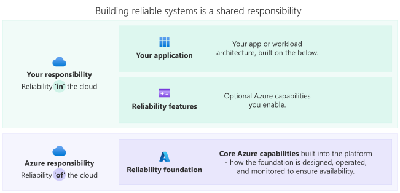

# Reliability in Azure

In cloud environments, failures are inevitable. Hardware faults, software defects, configuration errors, traffic spikes, data center outages, and even region-wide outages can occur. *Reliability* is the ability of a workload to keep meeting business expectations, even during failures or disruptions. With the right architecture and operations, failures don't need to result in downtime.

Unplanned downtime can have a huge impact. It carries financial cost and damages customer and user trust. Beyond these immediate impacts, poor reliability affects compliance obligations and competitive positioning. Your teams spend more time firefighting and less time delivering value. It might even trigger contractual service-level penalties.

Azure provides resilient infrastructure and managed services, but your workload's reliability depends on design and operational decisions you make: how you design your architecture, configure services, manage dependencies, automate responses to problems, and test software and processes. Designing for reliability early helps you minimize failures and ensures that, when they do occur, your workload degrades in predictable and controlled ways that align with business priorities.

A reliable workload has two essential properties:

- It's *resilient*, meaning it can absorb failures and changes in the environment while continuing to operate at an acceptable service level.
- It's also *recoverable*, meaning that when disruption occurs, the workload can restore normal operations within defined time and data-loss limits.

You need both properties to meet real-world availability expectations and maintain business continuity.

Reliability in Azure works across three interconnected layers:

- **Your application**: Your architectural choices, practices, and processes, including dependency management, runbooks, automation, and testing
- **Reliability features**, including:
  - **Workload services and configuration**: How you configure the Azure services that run your workload, and the reliability capabilities you configure within those services
  - **Azure platform services:** Azure services that specifically support workload reliability, such as load balancing, DNS, traffic routing, and monitoring
- **Reliability foundations**: Azure's built-in resilience, such as availability zones, regions, and safe deployment practices

These layers work together to determine overall workload reliability. Understanding them helps you distinguish between what Azure provides by default and what you need to design, configure, and operate.

This model helps you leverage what Azure provides while taking responsibility for what only you can design. This article focuses on what Azure provides across these layers. For comprehensive guidance on the workload design and operations layer (designing resilient solutions and architectural patterns), see the [Azure Well-Architected Framework](/azure/well-architected/) and especially the [reliability pillar](/azure/well-architected/reliability/).

## Shared responsibility for reliability

Reliability in Azure follows a shared responsibility model. Microsoft provides the resilient platform through Azure. You design the resilient workload.

- **Microsoft** owns the platform foundations and platform reliability services. This ownership includes the resilient infrastructure (physical redundancy, fault isolation, and healing), availability zones, regional distribution, safe deployment practices, and platform-level services like load balancing, traffic routing, and monitoring. Microsoft is responsible for the reliability of the Azure platform, and for the reliability of services as defined by each service's published SLA and documentation such as their [reliability guide](overview-reliability-guidance.md).

- **You** own the workload design and operations. You're responsible for translating Azure's capabilities into reliable workload behavior through architecture decisions, configuration choices, operational practices, and testing.

    Azure can't know your availability targets, acceptable tradeoffs, business context, or application-specific requirements. Only you can define those requirements and design accordingly. Azure provides capabilities, while you select and configure them. For example, you configure failover behavior for services like databases, and you define load balancer health probes that accurately represent application health so traffic routing decisions are correct, even during failures.

    > [!IMPORTANT]
    > The platform provides building blocks, not end-to-end guarantees. Your design and operational choices determine whether those capabilities translate into a reliable workload. For a full breakdown of the shared responsibility model, see [Shared responsibility in the cloud](concept-shared-responsibility.md).

Service level agreements (SLAs) define reliability commitments and expectations across Azure services. Understanding SLAs is essential when evaluating services and designing for specific availability targets. [Azure services publish SLA commitments](https://aka.ms/csla) that can vary by configuration and redundancy level. Other services you use from other providers might also publish SLAs. For comprehensive guidance on how SLAs work and relate to your workload's availability expectations, see [Service level agreements](concept-service-level-agreements.md).

## Resilient foundations in Azure

Azure is designed with multiple layers of resilience built into the platform itself. These foundations provide the base capabilities upon which reliable workloads are built:

- **Physical infrastructure resilience:** Azure datacenters are designed with redundant infrastructure like power, cooling, and network connectivity. The Azure fabric controller automatically isolates and manages hardware failures. It detects faults and orchestrates workload migration to healthy hardware without customer intervention.

- **Regions:** Azure operates in over 70 regions worldwide. This geographic distribution enables workloads to withstand region-wide disruptions and outages through planned failover capabilities, while following your data residency requirements. For more information, see [Azure regions overview](./regions-overview.md).

- **Availability zones:** Many Azure regions include physically separate datacenters within the same region. These availability zones are connected by high-speed, low-latency networks. Each zone has independent power, cooling, and networking to protect against datacenter-level failures while maintaining synchronous replication capabilities for many Azure services. For more information, see [What are availability zones?](./availability-zones-overview.md)

- **Safe deployments:** Azure implements controlled, staggered deployment processes for platform updates and service changes to minimize the risk of widespread service disruption. The platform rolls out updates gradually, such as across fault domains, availability zones, and regions, with automated rollback capabilities when it detects problems. This approach ensures that platform changes don't introduce reliability risks to customer workloads.

Azure provides these platform-level foundations automatically. They form the base layer upon which you build reliable workloads. However, you must still configure your services correctly and combine these capabilities in ways that meet your specific business requirements.

## Azure services that support your reliability

Azure provides platform capabilities that translate reliability concepts into actionable building blocks for your architecture. These capabilities work together to enable resilient architectures, and many Azure services include built-in implementations of these patterns:

| Capability | Description |
| --- | --- |
|  **AI-powered reliability optimization** | Uses AI-driven capabilities to assess and improve reliability. These capabilities analyze workload patterns, identify potential risks, and provide recommendations that help teams move from reactive troubleshooting to proactive reliability management. These capabilities surface reliability signals and translate them into actionable recommendations that help teams prioritize and improve reliability over time.  Azure provides several AI-driven reliability services, including: - [Azure Resiliency capabilities](/azure/resiliency/) - [Resiliency capabilities in Agents (preview) in Azure Copilot](/azure/copilot/resiliency-agent) - [Azure SRE Agent](/azure/sre-agent/)  These services analyze workload patterns and suggest improvements to optimize your reliability posture across the board. |
|  **Load balancing and traffic management** | Enables reliability by routing traffic between redundant instances and handling failover automatically. This capability is essential for maintaining service availability when individual components fail.  Azure provides load balancing at multiple layers, including: - [Azure Load Balancer](/azure/load-balancer/load-balancer-overview) for Layer-4 TCP/UDP traffic distribution - [Azure Application Gateway](/azure/application-gateway/overview) for Layer-7 HTTP routing with application-aware health checks - [Azure Front Door](/azure/frontdoor/front-door-overview) for global HTTP load balancing with rapid failover - [Azure Traffic Manager](/azure/traffic-manager/traffic-manager-overview) for DNS-based global endpoint distribution  If you need help deciding which load balancer to use for your scenario, see [Load balancing options](/azure/architecture/guide/technology-choices/load-balancing-overview). |
|  **Backup and data protection** | Safeguards against data loss and corruption, and enables recovery after a problem occurs.  Azure provides several backup and recovery capabilities, including: - [Azure Backup](/azure/backup/backup-overview) for centralized backup with configurable retention for virtual machines, blob containers, files, and some databases - Native backup and restore features in many Azure services, including most database services - [Bicep](/azure/azure-resource-manager/bicep/overview) and other infrastructure as code tools for configuration backup, drift protection, and rapid environment recreation  Review each Azure service's reliability guide to understand the backup approaches that the service supports. |
|  **Geographic replication and failover** | Enables recovery from regional failures through cross-region data replication and automated failover capabilities.  [Azure Site Recovery](/azure/site-recovery/site-recovery-overview) orchestrates disaster recovery for virtual machine workloads with automated replication and failover sequencing. Many Azure services also provide built-in geo-replication features, including: - [Azure Cosmos DB](/azure/cosmos-db/) with native cross-region data replication and failover capabilities - [Azure API Management](/azure/api-management/) with native cross-region failover capabilities  Service reliability guides detail any geo-replication options available for each service. |
|  **Monitoring and observability** | Provides comprehensive visibility into reliability posture and enables proactive response to issues.  Azure provides multiple observability services, including: - [Azure Monitor](/azure/azure-monitor/overview) and [Application Insights](/azure/azure-monitor/app/app-insights-overview) for real-time monitoring, alerting, and dependency tracking - [Health models in Azure Monitor](/azure/azure-monitor/health-models/overview) to monitor the health of a whole workload - [Azure Service Health](/azure/service-health/overview) for personalized alerts and guidance for Azure service issues that may affect your workloads  Together, these capabilities help you understand whether you're meeting reliability requirements and respond quickly when issues arise. |
|  **Reliability testing and validation** | Helps verify that workloads behave as expected under failure conditions and helps ensure your solution meets reliability requirements before issues affect users.  Azure provides reliability testing services, including: - [Azure Chaos Studio](/azure/chaos-studio/chaos-studio-overview) for controlled fault injection experiments to validate self-healing behavior and resilience to real-world failures - [Azure App Testing](/azure/app-testing/overview-what-is-azure-app-testing) for performance and functional testing to understand how applications behave, including under stress |

## Enable reliability in Azure services

The platform provides service-layer reliability capabilities through dozens of Azure services, each with specific strengths and use cases. Each service's reliability guide provides details on how the service can remain available during different scenarios, for example:

- **Transient faults**, which are short intermittent failures. The service guides provide recommendations for best practices to minimize their impact, such as retrying and using Microsoft-provided SDKs.
- **Availability zone failures**, so the service can automatically redirect requests to maintain high availability.
- **Region-wide failures**, so the service can fail over to a secondary region and continue operating during a region disruption.

To view the reliability guides for many Azure services, see [Reliability guides by service](./overview-reliability-guidance.md).

## Designing reliable workloads

Reliability emerges from a continuous cycle of defining targets, designing for failure and fast recovery, testing assumptions, and improving through operational learning. Use the Azure Well-Architected Framework and service reliability guides to understand what each service provides by default and what requires explicit configuration. For a structured approach to implementing reliability, see the [Azure Well-Architected Framework reliability maturity model](/azure/well-architected/reliability/maturity-model).

As you design, connect *foundational concepts* with *technical concepts*. Foundational concepts such as [business continuity](concept-business-continuity-high-availability-disaster-recovery.md) and [shared responsibility](concept-shared-responsibility.md) define what outcomes you need to achieve. Technical concepts such as [redundancy](concept-redundancy-replication-backup.md), [replication](concept-redundancy-replication-backup.md), [backup](concept-redundancy-replication-backup.md), [failover](concept-failover-failback.md), and [failback](concept-failover-failback.md) define how you implement those outcomes in your architecture and operations. [Service level agreements](concept-service-level-agreements.md) help you to understand the guarantees you receive from your service providers.

### Sovereignty and data residency

When you design reliability, include sovereignty and data residency requirements early because they affect region selection, replication strategy, and failover paths. A resilient architecture can still fail compliance requirements if failover or data movement crosses restricted boundaries. For more information, see [Reliability and sovereignty](./concept-reliability-sovereignty.md).

Reliability in Azure is achieved by combining resilient platform foundations with thoughtful workload design and operations. By understanding what Azure provides and where you need to make design and configuration decisions, you can build systems that continue to meet business expectations, even in the presence of failures.
