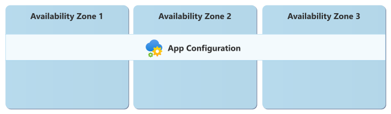

# Reliability in Azure App Configuration

[Azure App Configuration](/azure/azure-app-configuration/overview) centrally stores and manages application configuration settings and feature flags, replacing configuration files embedded directly within applications. This approach enables dynamic updates, versioning of configuration values, and historical tracking of configuration changes over time. The availability and reliability of App Configuration are important considerations because application behavior can directly depend on access to configuration data at runtime.

[!INCLUDE [Shared responsibility](includes/reliability-shared-responsibility-include.md)]

This article describes the reliability architecture of Azure App Configuration and explains how the service is designed to remain available during transient faults, availability zone failures, and region outages.

## Production deployment recommendations for reliability

For a list of recommended practices and configuration for production workloads, see [Building applications with high resiliency](/azure/azure-app-configuration/howto-best-practices#building-applications-with-high-resiliency).

## Reliability architecture overview

When you deploy App Configuration, you deploy a *store*. Your store contains various types of settings that your application might use, including [keys and values](/azure/azure-app-configuration/concept-key-value), and [feature flags](/azure/azure-app-configuration/concept-feature-management). The service provides other features for managing and organizing your settings. For more information, see [What is Azure App Configuration?](/azure/azure-app-configuration/overview)

App Configuration is a fully managed service. Microsoft is responsible for storing and managing your settings, as well as performing maintenance on the service.

When you build client applications that connect to Azure App Configuration, you can optionally [use App Configuration with Azure Front Door (preview)](/azure/azure-app-configuration/concept-hyperscale-client-configuration) to enable caching and global traffic acceleration. This configuration introduces other considerations for geo-replication, which are highlighted throughout this article where appropriate.

## Resilience to transient faults

[!INCLUDE [Transient fault description](includes/reliability-transient-fault-description-include.md)]

When you use Azure App Configuration, consider the following best practices to minimize the effect of transient faults on configuration access, especially within critical code paths.

- **Configuration providers:** Use the [Azure App Configuration provider libraries](/azure/azure-app-configuration/configuration-provider-overview), which have built-in retry and caching capabilities along with many other resiliency features.
- **SDKs:** Use App Configuration SDKs if your application needs to send write requests. SDKs automatically retry on HTTP status code 429 responses and other transient errors.
- **Retry logic:** Include retry logic in custom clients if you can't use App Configuration Providers or SDKs. The `retry-after-ms` header in the response provides a suggested wait time in milliseconds before retrying the request.
- **Caching:** Cache settings in memory when possible to reduce direct requests to your store.

For other application configuration guidance, see [Azure App Configuration FAQ](/azure/azure-app-configuration/faq#my-application-receives-http-status-code-429-responses--why).

## Resilience to availability zone failures

[!INCLUDE [Resilience to availability zone failures](~/reusable-content/ce-skilling/azure/includes/reliability/reliability-availability-zone-description-include.md)]

App Configuration automatically provides zone redundancy in [regions that support availability zones](./regions-list.md). This redundancy provides high availability within a region without requiring any specific configuration.

When an availability zone becomes unavailable, App Configuration automatically redirects your requests to other healthy availability zones to ensure high availability.

### Requirements

**Region support:** Stores deployed into the following regions are automatically zone-redundant:

[!INCLUDE [Azure App Configuration availability zones table](~/reusable-content/ce-skilling/azure/includes/azure-app-configuration-availability-zones.md)]

### Cost

There's no extra cost for zone redundancy for Azure App Configuration.

### Configure availability zone support

Microsoft automatically enables zone redundancy for a store when it's in [a region that supports availability zones](#requirements).

If App Configuration adds availability zone support to an existing region, you don't need to do anything to start benefiting from the availability zone support. Your store will benefit from the availability zone support that has become available for App Configuration stores in the region.

### Behavior when all zones are healthy

When a store is in a region that supports zone redundancy and all availability zones are operational, you can expect the following behavior:

- **Traffic routing between zones:** App Configuration automatically manages traffic routing between availability zones. During normal operations, it transparently distributes requests across zones.

- **Data replication between zones:** In regions that support zones, App Configuration synchronously replicates data across availability zones. This replication ensures that your settings remain consistent and available even if a zone becomes unavailable.

    > [!WARNING]
    > **Note to PG:** Please confirm that cross-zone replication is synchronous.

### Behavior during a zone failure

This section describes what to expect when a store is in a region that supports zone redundancy and an availability zone is unavailable:

- **Detection and response:** The App Configuration service detects zone failures and automatically responds to them. You don't need to take any action during a zone failure.

[!INCLUDE [Availability zone down notification (Service Health only)](./includes/reliability-availability-zone-down-notification-service-include.md)]

- **Active requests:** During a zone failure, the affected zone might fail to handle in-flight requests, which requires client applications to retry them. Client applications should follow [transient fault handling practices](#resilience-to-transient-faults) to ensure that they can retry requests if a zone failure occurs.

- **Expected data loss:** No data loss is expected during a zone failure because of the synchronous replication between zones.

    > [!WARNING]
    > **Note to PG:** Please confirm that cross-zone replication is synchronous.

- **Expected downtime:** A small amount of downtime, usually a few seconds, is expected while the service switches to use infrastructure in a healthy zone.

    > [!WARNING]
    > **Note to PG:** Please confirm that this statement about downtime is accurate.

- **Traffic rerouting:** App Configuration automatically reroutes traffic away from the affected zone to healthy zones without requiring any customer intervention.

### Zone recovery

When a zone that was previously unavailable recovers, App Configuration automatically restores normal operations across all availability zones. You don't need to take any action to recover from a zone failure.

### Test for zone failures

The Azure App Configuration platform manages traffic routing, failover, and zone recovery for zone-redundant stores. Because this process is fully managed by Microsoft, you don't need to validate availability zone failure processes.

## Resilience to region-wide failures

Azure App Configuration provides native geo-replication capabilities to support resilience during region outages. Geo-replication allows configuration data to be replicated across regions as a managed service feature.

### Geo-replication

Geo-replication enables a store to be replicated across multiple Azure regions. Each store can have multiple *replicas* in different regions. The original store is also a replica. This capability helps protect applications from region-wide disruptions.

#### Requirements

- **Region support:** You can create replicas in any Azure region supported by Azure App Configuration, even if the regions aren't Azure paired regions.

- **Tier:** The configuration store must use a supported tier to enable geo-replication. For more information, see [Enable geo-replication](/azure/azure-app-configuration/howto-geo-replication).

#### Considerations

When you enable geo-replication, consider the following factors:

- **Zone-redundant replicas:** Any replica you create in a region in which App Configuration supports availability zones is automatically zone-redundant.

- **Azure Front Door:** If you use Azure Front Door to access your store, your applications must connect through Azure Front Door, and Azure Front Door controls replica selection and failover. For more information, see [Hyperscale configuration delivery for client applications (preview) - Failover and load balancing](/azure/azure-app-configuration/concept-hyperscale-client-configuration#failover-and-load-balancing).

#### Cost

Each geo-replicated region is billed separately according to the pricing for the respective tier and region.

> [!WARNING]
> **Note to PG:** Is inter-region data egress charged? We say this in some other guides (for example, Azure Container Registry): "Egress charges also apply for data transfer between regions during initial replication and ongoing synchronization."

For pricing details, see [Azure App Configuration pricing](https://azure.microsoft.com/pricing/details/app-configuration/).

#### Configure multi-region support

To set up replication for a newly created configuration store, see [Enable geo-replication](/azure/azure-app-configuration/howto-geo-replication).

#### Behavior when all regions are healthy

This section describes what to expect when you configure an App Configuration store for geo-replication, and all regions are operational.

- **Traffic routing between regions:** Each replica is addressable individually and has its own DNS name. All replicas can accept both read and write operations.

    > [!WARNING]
    > **Note to PG:** Is it correct to say that each replica is individually addressable?
    
    Azure App Configuration doesn't automatically route traffic between regions. When you use Microsoft's configuration providers, your application can optionally use automatic replica discovery. Alternatively, you can specify a prioritized list of replicas, and App Configuration selects the first healthy replica. This enables your application to control which replica it uses.

    > [!NOTE]
    > If you use Azure Front Door, traffic routing behavior is different. For more information, see [Failover and load balancing](/azure/azure-app-configuration/concept-hyperscale-client-configuration#failover-and-load-balancing).

- **Data replication between regions:** Data is replicated asynchronously and is eventually consistent. You can use the [replication latency metric in Azure Monitor](/azure/azure-app-configuration/concept-geo-replication#monitoring) to monitor the current replication latency between replicas.

    > [!WARNING]
    > **Note to PG:** Can we give an approximate replication latency time here like 'typically within 15 minutes', or even a very general idea, like "a few minutes"?

#### Behavior during a region failure

This section describes what to expect when you configure a store for geo-replication, and there's an outage in one of the replica regions.

- **Detection and response:** Microsoft is responsible for detecting region or replica failures and initiating recovery processes.
    
    When you configure Microsoft's configuration providers to perform automatic replica discovery or with a list of multiple replicas, your application automatically fails over to another healthy replica.
    
    If you don't use Microsoft's configuration providers, you're responsible for switching your application to a healthy replica.

- **Notification:** [!INCLUDE [Region down notification partial bullet (Azure Service Health only)](./includes/reliability-region-down-notification-service-partial-include.md)]

- **Active requests:** Active requests against a replica in the region might be dropped. Client applications should retry the requests against a different replica.

- **Expected data loss:** If a replica fails, recent changes made on that replica might not yet be replicated to other replicas. Those changes can remain unavailable until the replica recovers. To estimate potential data loss, monitor the [replication latency metric in Azure Monitor](/azure/azure-app-configuration/concept-geo-replication#monitoring).

- **Expected downtime:** When a replica becomes unavailable, it stays offline until its region recovers. Other replicas continue to handle requests. Applications might experience brief downtime while they detect the failure and switch to a healthy replica. The duration depends on how quickly each application performs this detection and failover.

- **Traffic rerouting:** Applications must route traffic to a healthy replica when a failure occurs.

    If you use Microsoft configuration provider libraries, the libraries automatically handle replica selection and failover.
    
    If you place Azure Front Door in front of your data store and [configure the origin group for failover](/azure/azure-app-configuration/concept-hyperscale-client-configuration#failover-and-load-balancing), Azure Front Door automatically reroutes requests to a healthy replica.

#### Region recovery

After the region recovers, App Configuration brings the replica back in sync with the other replicas without your intervention.

You're responsible for reconfiguring your application to route traffic back to the recovered region instance. Applications that use Microsoft configuration providers automatically start using the replica again.

#### Test for region failures

You can't simulate a replica failure. However, applications control replica selection, so they can dynamically switch replicas to test their failover behavior.

> [!WARNING]
> **Note to PG:** Do you have any other suggestions for how to test an application's behavior during a replica failure?

## Backup and restore

Azure App Configuration enables you to [export configuration data](/azure/azure-app-configuration/howto-import-export-data) from a store and use it as part of a broader backup strategy.

[!INCLUDE [Backups description](includes/reliability-backups-include.md)]

## Resilience to accidental deletion

App Configuration provides two key recovery features to prevent accidental or malicious deletion:

- **Soft delete:** When enabled, soft delete allows you to recover deleted stores and settings during a configurable retention period. Think of soft delete like a recycle bin for your App Configuration resources.

- **Purge protection:** When enabled, purge protection prevents permanent deletion of your store and its settings until the retention period elapses. This safeguard prevents malicious actors from permanently destroying your settings.

Use both features for production environments. For more information, see [Soft-delete and purge protection](/azure/azure-app-configuration/concept-soft-delete).

## Resilience to service maintenance

Microsoft regularly performs service updates and other maintenance. The service handles these activities automatically, ensuring that maintenance is seamless and transparent to customers. No downtime occurs during maintenance events. As a result, no customer actions are required to maintain reliability.

> [!WARNING]
> **Note to PG:** Please verify that we're OK to say "No downtime is expected during maintenance events."

## Resilience to configuration problems

Incorrect or accidental configuration changes can cause application downtime. Use [configuration snapshots](/azure/azure-app-configuration/concept-snapshots) to safely roll out changes to configuration. Monitor your application health following any configuration changes, and revert to the last-known-good configuration snapshot if the changes introduce a problem.

## Service-level agreement

[!INCLUDE [Service-level agreement](includes/reliability-service-level-agreement-include.md)]

## Related content

- [Reliability in Azure](./overview.md)
- [Azure App Configuration documentation](/azure/azure-app-configuration/)
