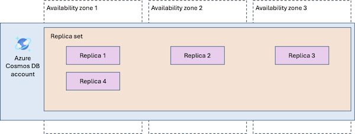

# Reliability in Azure Cosmos DB

[!INCLUDE [Shared responsibility](includes/reliability-shared-responsibility-include.md)]

## Production deployment recommendations

The Azure Well-Architected Framework provides recommendations across reliability, security, cost, operations, and performance. To understand how these areas influence each other and contribute to a reliable Azure Cosmos DB solution, see [Architecture best practices for Azure Cosmos DB](/azure/well-architected/service-guides/cosmos-db).

## Reliability architecture overview

<!-- TODO -->

- Logical
    - Account, database, containers - serve as the logical units of distribution and scalability. You create collections, tables, and graphs and these are internally represented as containers.
    - Logical partitioning
    - Global distribution

- Physical
    - [Global data distribution with Azure Cosmos DB - under the hood](/azure/cosmos-db/global-distribution)
    - Quorums

## Resilience to transient faults

[!INCLUDE [Resilience to transient faults](includes/reliability-transient-fault-description-include.md)]

<!-- TODO -->

[Design resilient applications with Azure Cosmos DB SDKs](/azure/cosmos-db/conceptual-resilient-sdk-applications)

<a name="availability-zone-support" />

## Resilience to availability zone failures

[!INCLUDE [Resilience to availability zone failures](~/reusable-content/ce-skilling/azure/includes/reliability/reliability-availability-zone-description-include.md)]

Azure Cosmos DB supports *zone redundancy*. When you enable zone redundancy, Azure distributes the replicas of your data across multiple availability zones, providing resiliency to datacenter problems and outages. Microsoft selects the availability zones to use.



An Azure Cosmos DB account might use multiple regions (locations). You can configure zone redundancy separately for each region in your account.

Using zone redundancy in Azure Cosmos DB has no discernible impact on performance or latency. It doesn't require any adjustments to the selected consistency mode, and also doesn't require any modification to application code.

We recommend using zone redundancy in regions where it's supported, especially for single-region accounts. Because availability zones are physically separate and provide distinct power source, network, and cooling, the availability SLAs for Azure Cosmos DB are higher for zone-redundant accounts than accounts that don't use availability zones.

> [!TIP]
> Enabling zone redundancy is a great way to increase the resilience of your Azure Cosmos DB database without introducing additional application complexities, affecting performance, or even incurring additional costs (if autoscale is also used).

If you don't enable zone redundancy, the account is *nonzonal* in that region. That means that all of the replicas could be located in a single availability zone, leading to potential downtime if that specific zone experiences an issue.

### Requirements

- **Region support:** You can enable zone redundancy in Azure regions that supports availability zones. To see if your region supports availability zones, see [the list of supported regions](./regions-list.md).

    Enabling zone redundancy isn't an account-wide choice. A single Azure Cosmos DB account can span an arbitrary number of Azure regions, each of which can independently be configured to use zone redundancy. Some regions don't yet support availability zones, but adding them to an Azure Cosmos DB account won't prevent enabling zone redundancy in other regions configured for that account.

- **Serverless:** Serverless accounts can use availability zones, but this choice is only available during account creation. Existing accounts without availability zones cannot be converted to an availability zone configuration. For mission critical workloads, provisioned throughput is the recommended choice. <!-- TODO verify still correct -->

### Considerations

- **Multiple simultaneous zone outages:** A single-region account with zone redundancy can maintain read-write availability when an outage affects only one availability zone. However, if multiple availability zones or the entire region is impacted, single-region accounts lose read and write access until service is restored.

<!-- TODO interactions between multi-region and AZ support -->

### Cost

Regions where zone redundancy is enabled are charged at a premium. However, the premium pricing for availability zones is waived for accounts configured with multi-region writes, and for collections configured to use autoscale throughput mode. For more information, see [Azure Cosmos DB pricing](https://azure.microsoft.com/pricing/details/cosmos-db/).

### Configure availability zone support

You can configure availability zones only when you add a new region to an Azure Cosmos DB account.

> [!NOTE]
> If you receive an error during deployment indicating the region is constrained and you can't enable zone redundancy, [open a support request](/azure/azure-portal/supportability/how-to-create-azure-support-request) to request capacity in the region's zones.

- **Create a new Azure Cosmos DB account with zone redundancy:** When you create a new Azure Cosmos DB account, you can configure zone redundancy on one or more regions by using these instructions:

    - [Azure portal](/azure/cosmos-db/quickstart-portal). When deploying, set the *Availability Zones* setting to *Enabled*.
    - [Azure CLI](/azure/cosmos-db/how-to-create-account?tabs=azure-cli). When setting the `--locations` argument, set `isZoneRedundant=True` for the regions you want to make zone-redundant.
    - [Bicep](/azure/cosmos-db/quickstart-template-bicep). Update the `isZoneRedundant` property to `true` for the regions you want to make zone-redundant.
    - [Azure Resource Manager templates](/azure/cosmos-db/quickstart-template-json). Update the `isZoneRedundant` property to `true` for the regions you want to make zone-redundant.

- **Add a zone-redundant region to an existing Azure Cosmos DB account:** To enable availability zone support on an existing account, you need to add the region and enable zone redundancy on itr. Follow these instructions to add a region:

    - [Azure portal](/azure/cosmos-db/how-to-manage-database-account#add-remove-regions-from-your-database-account)
    - [Azure CLI](/azure/cosmos-db/manage-with-cli#add-or-remove-regions)
    - [Bicep](/azure/cosmos-db/manage-with-bicep)
    - [Azure Resource Manager templates](/azure/cosmos-db/manage-with-templates)

- **Enable zone redundancy on an existing region in your account:** Because you can't enable zone redundancy for a region that has already been added to your account, you need to remove that region and add it again with availability zones enabled. To avoid any service disruption, add a temporary region and fail over to it until the availability zone configuration is complete. Follow the steps below to enable availability zones for your account in select regions.

    # [Azure portal](#tab/portal)

    1. Add a temporary region to your database account by following steps in [Add region to your database account](/azure/cosmos-db/how-to-manage-database-account#add-remove-regions-from-your-database-account).

    1. If your Azure Cosmos DB account is configured with multi-region writes, skip to the next step. Otherwise, perform manual failover to the temporary region by following the steps in [Perform manual failover on an Azure Cosmos DB account](/azure/cosmos-db/how-to-manage-database-account?source=recommendations#manual-failover).

    1. Remove the region for which you would like to enable availability zones by following steps in [Remove region to your database account](/azure/cosmos-db/how-to-manage-database-account#add-remove-regions-from-your-database-account).

    1. Add back the region to be enabled with availability zones:
        1. [Add region to your database account](/azure/cosmos-db/how-to-manage-database-account#add-remove-regions-from-your-database-account).
        1. Find the newly added region in the **Write region** column, and enable **Availability Zone** for that region. 
        1. Select **Save**.

    1. Perform failback to the availability zone-enabled region by following the steps in [Perform manual failover on an Azure Cosmos DB account](/azure/cosmos-db/how-to-manage-database-account?source=recommendations#manual-failover).

    1. Remove the temporary region by following steps in [Remove region to your database account](/azure/cosmos-db/how-to-manage-database-account#add-remove-regions-from-your-database-account).

    # [Azure CLI](#tab/cli)

    1. Add a temporary region to your database account. The following example shows how to add West US as a secondary region to an account configured with East US region only. You must include all existing regions and any new ones in the command.

        ```azurecli        
        az cosmosdb update \
            --name MyCosmosDBDatabaseAccount \
            --resource-group MyResourceGroup \
            --locations regionName=eastus failoverPriority=0 isZoneRedundant=False \
            --locations regionName=westus failoverPriority=1 isZoneRedundant=False        
        ```

    1. If your Azure Cosmos DB account is configured with multi-region writes, skip to the next step.
    
        Otherwise, perform manual failover to the newly added temporary region. The following example shows how to perform a failover from East US region (current write region) to West US region (current read-only region). You must include both regions in the command. 

        ```azurecli
        az cosmosdb failover-priority-change \
            --name MyCosmosDBDatabaseAccount \
            --resource-group MyResourceGroup \
            --failover-policies westus=0 eastus=1
        ```

    1. Remove the region for which you would like to enable availability zones. The following example shows how to remove East US region from an account configured with West US (write region) and East US (read-only) regions. You must include all regions that shouldn't be removed in the command. 

        ```azurecli        
        az cosmosdb update \
            --name MyCosmosDBDatabaseAccount \
            --resource-group MyResourceGroup \
            --locations regionName=westus failoverPriority=0 isZoneRedundant=False        
        ```
    
    1. Add back the region to be enabled with availability zones. The following example shows how to add East US as an AZ-enabled secondary region to an account configured with West US region only. You must include any existing regions and all new ones in the command. 
        
        ```azurecli
        az cosmosdb update \
            --name MyCosmosDBDatabaseAccount \
            --resource-group MyResourceGroup \
            --locations regionName=westus failoverPriority=0 isZoneRedundant=False \
            --locations regionName=eastus failoverPriority=1 isZoneRedundant=True
        ```

    1. Perform failback to the availability zone-enabled region. The following example shows how to perform a failover from West US region (current write region) to East US region (current read-only region). You must include both regions in the command. 
    
        ```azurecli
        az cosmosdb failover-priority-change \
            --name MyCosmosDBDatabaseAccount \
            --resource-group MyResourceGroup \
            --failover-policies eastus=0 westus=1
        ```

    1. Remove the temporary region. The following example shows how to remove West US region from an account configured with East US (write region) and West US (read-only) regions. You must include all accounts that shouldn't be removed in the command. 
    
        ```azurecli        
        az cosmosdb update \
            --name MyCosmosDBDatabaseAccount \
            --resource-group MyResourceGroup \
            --locations regionName=eastus failoverPriority=0 isZoneRedundant=True        
        ```
    
    ---

    > [!WARNING]
    > When you enable zone redundancy for a region, a few seconds of of write unavailability occurs when adding and removing the secondary region, as the system deliberately stops writes in order to check consistency between regions.

### Behavior when all zones are healthy

This section describes what to expect when you configure an Azure Cosmos DB account for zone redundancy, and all zones are operational.

- **Cross-zone operation:** Requests are automatically spread across the replicas in each availability zone. A request might go to a replica in any availability zone.

- **Cross-zone data replication:** When a client makes a change to any data, that change is applied to multiple replicas in different zones simultaneously. This approach is referred to as *synchronous replication*. Synchronous replication ensures a high level of data consistency, which reduces the likelihood of data loss during a zone failure. Availability zones are located relatively close together, which means there's minimal effect on latency or throughput.

### Behavior during a zone failure

This section describes what to expect when you configure an Azure Cosmos DB account for zone redundancy, and there's an outage in one of the zones.

- **Detection and response:** The Azure Cosmos DB platform is responsible for detecting a failure in an availability zone. You don't need to do anything to initiate a zone failover.

[!INCLUDE [Availability zone down notification (Service Health and Resource Health)](./includes/reliability-availability-zone-down-notification-service-resource-include.md)]

- **Active requests:** When an availability zone is unavailable, any requests in progress that are connected to a replica in the faulty availability zone are terminated and need to be retried. Ensure that your applications are prepared by following [transient fault handling guidance](#resilience-to-transient-faults).

- **Expected data loss:** A zone failure isn't expected to cause any data loss.

- **Expected downtime:** During zone outages, connections might experience brief interruptions that typically last a few seconds as traffic is redistributed. Ensure that your applications are prepared by following [transient fault handling guidance](#resilience-to-transient-faults).

- **Redistribution:** Azure Cosmos DB automatically redirects incoming requests to healthy replicas in other availability zones. When an availability zone has an outage, the platform automatically reallocates provisioned throughput to other replicas.

### Zone recovery

When the availability zone recovers, Azure Cosmos DB automatically restores replicas in the availability zone, and reroutes traffic between replicas as normal.

### Test for zone failures

Your applications can partially simulate the zone outage behavior by using the Azure Cosmos DB Fault Injection library for Java. The [Server Return Gone](/java/api/overview/azure/cosmos-test-readme#server-return-gone-scenario) scenario lets you inject `GONE` errors into specific replicas, exercising the same SDK retry and re-routing code paths that activate during a real zone outage. <!-- TODO review this more -->

## Resilience to region-wide failures

<!-- TODO -->

### Multi-region read and write

<!-- TODO -->

#### Requirements

- **Region support:** <!-- TODO -->

#### Considerations

<!-- TODO -->

#### Cost

<!-- TODO -->

#### Configure multi-region support

<!-- TODO -->

#### Capacity planning and management

<!-- TODO -->

#### Behavior when all regions are healthy

This section describes what to expect when you configure an Azure Cosmos DB account for multi-region support, and all regions are operational.

- **Cross-region operation:** <!-- TODO -->

- **Cross-region data replication:** <!-- TODO -->

#### Behavior during a region failure

This section describes what to expect when you configure an Azure Cosmos DB account for multi-region support, and there's an outage in one of the replica regions.

- **Detection and response:** <!-- TODO -->

- **Notification:** <!-- TODO -->

- **Active requests:** <!-- TODO -->

- **Expected data loss:** <!-- TODO -->

- **Expected downtime:** <!-- TODO -->

- **Redistribution:** <!-- TODO -->

#### Region recovery

<!-- TODO -->

#### Test for region failures

<!-- TODO -->

### Custom multi-region solutions for resiliency

<!-- TODO -->

## Backup and restore

<!-- TODO -->

## Resilience to service maintenance

[!INCLUDE [Service maintenance description - transient fault](includes/reliability-maintenance-transient-fault-include.md)]

<!-- TODO maybe add more -->

## Service-level agreement

[!INCLUDE [Service-level agreement](includes/reliability-service-level-agreement-include.md)]

Azure Cosmos DB provides SLAs for a range of configurations and service characteristics, including availability, latency, throughput, and consistency.

The availability SLAs are different depending on whether you use any of the following product capabilities:

- Provisioned throughput
- Single-region account with availability zone support (zone redundancy)
- Accounts that use multiple read regions
- Accounts that use multiple write regions

## Related content

<!-- TODO -->
