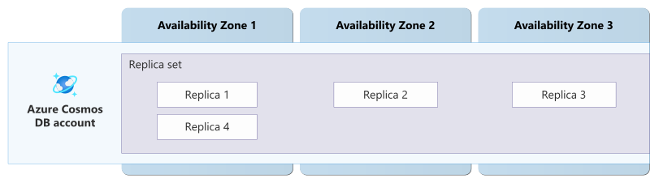

# Reliability in Azure Cosmos DB

Azure Cosmos DB for NoSQL is a globally distributed, multi-model database service that supports document data models with flexible schemas. Azure Cosmos DB offers comprehensive reliability features including multiple consistency levels that let you balance performance and availability, zone-redundant deployments that protect against availability zone failures, multi-region replication with service-managed or customer-managed failover, and continuous and periodic backup options for data protection.

[!INCLUDE [Shared responsibility](includes/reliability-shared-responsibility-include.md)]

This article describes how to make Azure Cosmos DB resilient to various potential outages and problems, including transient faults, availability zone outages, region outages, and service maintenance. It also describes how to use backups to recover from other types of problems and highlights key information about the Azure Cosmos DB service-level agreement (SLA).

## Production deployment recommendations

The Azure Well-Architected Framework provides recommendations across reliability, security, cost, operations, and performance. To understand how these areas influence each other and contribute to a reliable Azure Cosmos DB solution, see [Architecture best practices for Azure Cosmos DB](/azure/well-architected/service-guides/cosmos-db).

## Reliability architecture overview

[!INCLUDE [Introduction to reliability architecture overview section](includes/reliability-architecture-overview-introduction-include.md)]

### Logical architecture

The primary resource you deploy is an Azure Cosmos DB *account*. Each account can have multiple *databases* with multiple *containers*. Containers serve as the logical units of distribution and scalability. You can create containers such as collections, tables, and graphs, depending on the API you use to interact with Azure Cosmos DB. For more information about the resource model, see [Databases, containers, and items in Azure Cosmos DB](/azure/cosmos-db/resource-model). Each container uses [partitioning](/azure/cosmos-db/partitioning), which supports high scale and high performance.

You configure *throughput*, which represents the amount of system resources that you can use for querying and working with your data. You can [manually provision throughput](/azure/cosmos-db/set-throughput), [use autoscale](/azure/cosmos-db/provision-throughput-autoscale) to dynamically adjust capacity based on your workload's requirements, or use the [serverless account type](/azure/cosmos-db/serverless) to be charged for your actual usage.

A single account can [span multiple Azure regions](/azure/cosmos-db/distribute-data-globally), which increases your resiliency to region outages. You can configure multiple regions for reading, and if you use the [Business Critical tier](/azure/cosmos-db/multi-region-writes), you can use multiple regions for writing. Azure Cosmos DB automatically geo-replicates your data. Geo-replication behavior is affected by the configuration you use, such as the [consistency level](/azure/cosmos-db/consistency-levels), which indicates how you wish to make tradeoffs between data consistency, availability, latency, and throughput. Different consistency levels optimize for different concerns, support different guarantees, and provide different types of cross-region replication.

### Physical architecture

Azure Cosmos DB stores multiple *replicas* of your data for redundancy. The service automatically mitigates replica outages by maintaining quorum across replicas in each region. This approach guarantees high availability and protects against data loss during individual node failures, without requiring application changes or configuration.

Internally, Azure Cosmos DB manages your data through various constructs including *physical partitions*, *partition sets*, and *replica sets*. For more detailed information on how Azure Cosmos DB works, see [Global data distribution with Azure Cosmos DB - under the hood](/azure/cosmos-db/global-distribution).

## Resilience to transient faults

[!INCLUDE [Resilience to transient faults](includes/reliability-transient-fault-description-include.md)]

Use the Azure Cosmos DB SDKs. The SDKs automatically implement support for a range of resiliency considerations, including transient fault handling through automatic retries, and honoring rate limit responses sent by the service. For more information, see [Design resilient applications with Azure Cosmos DB SDKs](/azure/cosmos-db/conceptual-resilient-sdk-applications).

When working with a multiregion account, the SDK also supports a [threshold-based availability strategy](/azure/cosmos-db/performance-tips-dotnet-sdk-v3#threshold-based-availability-strategy), also called *hedging*, where it sends parallel read requests to multiple regions and accepts the fastest response. This approach can improve application performance when a region temporarily experiences higher latency than usual.

## Resilience to availability zone failures

[!INCLUDE [Resilience to availability zone failures](~/reusable-content/ce-skilling/azure/includes/reliability/reliability-availability-zone-description-include.md)]

Azure Cosmos DB supports *zone redundancy*. When you enable zone redundancy, Azure distributes the replicas of your data across multiple availability zones, providing resiliency to datacenter problems and outages. Microsoft selects the availability zones to use.

An Azure Cosmos DB account might use multiple regions (locations) for global distribution, scale, and failover. You configure zone redundancy separately for each region in your account.

Using zone redundancy in Azure Cosmos DB has no discernible impact on performance or latency. It doesn't require any adjustments to the selected consistency mode, and doesn't require any modification to application code.

Use zone redundancy in regions where it's supported, especially for single-region accounts. Because availability zones are physically separate and provide distinct power sources, networks, and cooling, the availability SLAs for Azure Cosmos DB are higher for zone-redundant accounts than accounts that don't use availability zones.

> [!TIP]
> Enabling zone redundancy is a great way to increase the resilience of your Azure Cosmos DB database without introducing additional application complexities or affecting performance. Depending on your account configuration, it might not even incur additional costs.

If you don't enable zone redundancy, the account is *nonzonal* in that region. Nonzonal accounts could locate replicas in a single availability zone, leading to potential downtime if that specific zone experiences an issue.

### Requirements

- **Region support:** You can enable zone redundancy in Azure regions that supports availability zones. To see if your region supports availability zones, see [the list of supported regions](./regions-list.md).

    Zone redundancy isn't an account-wide setting. Azure Cosmos DB accounts can span multiple regions, and each region can be configured independently to use availability zones. Regions that don't support availability zones don't prevent you from enabling zone redundancy in other regions within the same account.

- **Serverless accounts:** You can only configure zone redundant serverless accounts when you create them. You can't convert existing serverless accounts without availability zones to an availability zone configuration. For mission-critical workloads, use provisioned throughput.

### Considerations

- **Multiple simultaneous zone outages:** A single-region account with zone redundancy can maintain read-write availability when an outage affects a single availability zone. However, if the outage affects multiple availability zones or the entire region, single-region accounts lose read and write access until service is restored. Consider deploying a multiregion account if you need to be resilient to multiple zones failing at the same time.

- **Multiregion accounts:** If you have a multiregion account, you can optionally enable zone redundancy on any or all of the account regions that support availability zones. Enable zone redundancy when your account is configured to use a single region, or if it's configured to use a single write region with multiple read regions.

### Cost

Regions where zone redundancy is enabled are charged at a premium. However, the premium pricing for availability zones is waived for accounts configured with multi-region writes, and for collections configured to use autoscale throughput mode. For more information, see [Azure Cosmos DB pricing](https://azure.microsoft.com/pricing/details/cosmos-db/).

### Configure availability zone support

For most accounts, you enable zone redundancy only when you add a new region to an Azure Cosmos DB account. To enable availability zone support on an existing account, add a region and enable zone redundancy on it. You can follow a process to add a temporary region so that you can configure zone redundancy in your original region. For detailed steps, see [Enable zone redundancy on an Azure Cosmos DB account](/azure/cosmos-db/enable-zone-redundancy).

For serverless accounts, you must enable zone redundancy when you create the account.

### Behavior when all zones are healthy

This section describes what to expect when you configure an Azure Cosmos DB account for zone redundancy, and all zones are operational.

- **Cross-zone operation:** Azure Cosmos DB automatically routes requests to replicas across availability zones, so any replica can serve a request.

- **Cross-zone data replication:** When a client makes a change to any data, that change is applied to multiple replicas in different zones to achieve quorum. This approach is referred to as *synchronous replication*. Synchronous replication ensures a high level of data consistency, which reduces the likelihood of data loss during a zone failure. Availability zones are located relatively close together, which means there's minimal effect on latency or throughput.

### Behavior during a zone failure

This section describes what to expect when you configure an Azure Cosmos DB account for zone redundancy, and there's an outage in one of the zones.

- **Detection and response:** The Azure Cosmos DB platform is responsible for detecting a failure in an availability zone. You don't need to do anything to initiate a zone failover.

[!INCLUDE [Availability zone down notification (Service Health and Resource Health)](./includes/reliability-availability-zone-down-notification-service-resource-include.md)]

- **Active requests:** When an availability zone becomes unavailable, Azure Cosmos DB terminates any in‑progress requests connected to replicas in the affected zone, and the application must retry those requests. Ensure that your application is prepared by following [transient fault handling guidance](#resilience-to-transient-faults).

- **Expected data loss:** There is no expected data loss from a zone failure.

- **Expected downtime:** During zone outages, connections might experience brief interruptions that typically last a few seconds as traffic is redistributed. Ensure that your applications are prepared by following [transient fault handling guidance](#resilience-to-transient-faults).

- **Redistribution:** Azure Cosmos DB automatically redirects incoming requests to healthy replicas in other availability zones. When an availability zone has an outage, the platform automatically reallocates provisioned throughput to other replicas.

### Zone recovery

When the availability zone recovers, Azure Cosmos DB automatically restores replicas in the availability zone, and reroutes traffic between replicas as normal.

### Test for zone failures

Availability zone failover and recovery for Azure Cosmos DB are fully managed by Microsoft. You don’t need to initiate or validate availability zone failure processes.

## Resilience to region-wide failures

When you deploy an Azure Cosmos DB account in a single region, a region-wide outage that affects all Azure Cosmos DB nodes typically doesn't cause data loss, but it does prevent your application from accessing data. Azure Cosmos DB restores data access after the service recovers in the affected region. Data loss occurs only if the region experiences an unrecoverable disaster.

To prepare for the rare cases of region outages, you can configure Azure Cosmos DB to support various levels of durability and availability by using one of these approaches:
- [Multiple read regions with a single write region.](#multiple-read-regions-with-a-single-write-region) You can optionally enable service-managed failover or per-partition automatic failover (PPAF).
- [Multiple write regions.](#multiple-write-regions)

The following table summarizes the recovery options available based on the account configuration and the type of outage. Later sections of this article provide extensive details of these options and the associated behavior.

| Configuration | Outage type | Availability impact | Durability impact | What to do |
| -- | -- | -- | -- | -- |
| Single-region account | Region outage | Read and write access is lost until service is restored. | No data loss unless the region experiences an unrecoverable disaster. | Wait for service restoration or request account restore from backup to another region. |
| Single-write region, multiple-region account | Read region outage | SDK reroutes to available regions based on preferred regions configuration.    For accounts using strong consistency with only two regions or bounded staleness exceeding the staleness window, write availability is also lost unless you [take the affected region offline](/azure/cosmos-db/how-to-manage-database-account#perform-forced-failover-for-your-azure-cosmos-db-account). | No data loss. | Ensure sufficient throughput in remaining regions. For strong or bounded staleness consistency, consider [taking the affected region offline](/azure/cosmos-db/how-to-manage-database-account#perform-forced-failover-for-your-azure-cosmos-db-account). |
| Single-write region, multiple-region account | Write region outage (with PPAF enabled) | Automatic partition-level failover; no manual intervention required. | If account uses strong consistency, no data loss. If the account doesn't use strong consistency, unreplicated data could be lost in the unlikely event that the region suffers permanent data loss. | No action required. PPAF manages failover automatically. |
| Single-write region, multiple-region account | Write region outage (without PPAF) | Write availability is lost until a region offline operation or service-managed failover completes. Reads continue from healthy regions. | If account uses strong consistency, no data loss. If the account doesn't use strong consistency, unreplicated data could be lost in the unlikely event that the region suffers permanent data loss. | Perform a [region offline operation](/azure/cosmos-db/how-to-manage-database-account#perform-forced-failover-for-your-azure-cosmos-db-account). If service-managed failover is enabled, Azure Cosmos DB initiates failover automatically, but this might take one hour or more. Don't change the write region during the outage. |
| Multiple-write region account | Any region outage | Automatic routing to healthy regions via SDK configuration; no manual intervention required. | Recently updated data in the failed region might be unavailable in remaining regions. In the unlikely event that the region suffers permanent data loss, unreplicated data could be lost. | Ensure sufficient throughput in remaining regions. After recovery, Azure Cosmos DB automatically recovers unreplicated data using the configured conflict resolution method. |
| Any account configuration | Data corruption or accidental deletion | No availability impact. | Potential data loss depending on when the corruption or deletion is detected. | Point-in-time restore (continuous backup) or restore from periodic backup. |

> [!NOTE]
> This article focuses on the reliability aspects of the multiregion features of Azure Cosmos DB. There are other benefits to multiple read and write regions, such as higher performance and scale for globally distributed applications. Evaluate your whole solution architecture and consider all the benefits of using these capabilities.

#### SDKs and resiliency

The Azure Cosmos DB SDKs are an important part of your application's resiliency strategy. When you have a multiregion account, the SDK configuration affects how requests are routed between regions, including the preferred regions to connect to and regions that should be excluded. The SDKs monitor the availability of regions and partitions and can dynamically reconfigure themselves to use healthy regions and partitions, such as through the partition-level circuit breaker.

For more information about how the SDK supports high availability, see the high availability documentation for the SDK you use:

- [Azure Cosmos DB .NET SDK v3](/azure/cosmos-db/performance-tips-dotnet-sdk-v3?tabs=trace-net-core#high-availability)
- [Azure Cosmos DB Java SDK v4](/azure/cosmos-db/performance-tips-java-sdk-v4#high-availability)
- [Azure Cosmos DB Python SDK](/azure/cosmos-db/performance-tips-python-sdk#high-availability)

#### Potential data loss during region outages

When you deploy an Azure Cosmos DB account in multiple regions, data durability depends on the consistency level you configure on the account. The following table details, for all consistency levels, the recovery point objective (RPO) of an Azure Cosmos DB account that's deployed in at least two regions. The RPO represents the potential data loss during a region outage.

|**Consistency level**|**RPO for region outage**|
|---------|---------|
|Session, consistent prefix, eventual|Less than 15 minutes|
|Bounded staleness|*K* and *T*|
|Strong|0|

*K* = The number of versions (that is, updates) of an item.

*T* = The time interval since the last update.

For multiple-region accounts, the minimum value of *K* and *T* is 100,000 write operations or 300 seconds. This value defines the minimum RPO for data when you're using bounded staleness.

For more information on the differences between consistency levels, see [Consistency levels in Azure Cosmos DB](/azure/cosmos-db/consistency-levels).

### Multiple read regions with a single write region
 
If your solution requires continuous uptime during region outages, you can configure Azure Cosmos DB to replicate your data across multiple regions, with writes handled by your primary region. You can optionally configure your applications to connect to specific read regions, which can help to improve their performance. If a region has an outage, the account can continue to operate from healthy regions.

#### Failover between regions

You can configure the Azure Cosmos DB SDK with a prioritized list of read regions. The SDK connects your application to the first available region in the list. During a read region outage, the SDK detects the region outage through backend response codes, marks it as unavailable, and routes future operations to the next available region in the preference list. Ensure that the preferred regions list is set correctly and aligns with your business and latency requirements. For detailed guidance, see [Troubleshoot Azure Cosmos DB SDK availability](/azure/cosmos-db/troubleshoot-sdk-availability).

Failover is the process of making one of your account's regions unavailable, either completely or in part. The effect of a failover depends on whether the region is a write region or a read region:

- If a write region becomes unavailable, another region becomes the write region.
- If a read region becomes unavailable, that region can't serve read requests and other regions are used for read operations instead.

Azure Cosmos DB provides multiple types of failover:

- **Per-partition automatic failover (PPAF):** Internally, Azure Cosmos DB spreads your data across multiple physical partitions. If a problem occurs with the infrastructure supporting a partition, other partitions might not be affected. PPAF enables single-write region accounts to automatically fail over individual partitions to a secondary region while keeping healthy partitions in the primary region. PPAF can help to minimize downtime and enable faster recovery during a partial region failure. For more information, see [How to onboard and adopt Per-Partition Automatic Failover (PPAF) for Azure Cosmos DB](/azure/cosmos-db/how-to-configure-per-partition-automatic-failover).

    > [!NOTE]
    > Per Partition Automatic Failover is in public preview. This feature is provided without a service level agreement. For more information, see [Supplemental Terms of Use for Microsoft Azure Previews](https://azure.microsoft.com/support/legal/preview-supplemental-terms/).

- **Forced failover:** You can take one of your account's regions offline. This is also referred to as a *customer managed failover*, or an *offline region* operation. This is the recommended approach for quickly restoring availability during an outage. You're responsible for detecting the outage and triggering the failover. You can also use forced failovers to simulate region-down scenarios for testing, like during a disaster recovery drill.

    If you take the write region offline, the read region with the next highest priority becomes the new write region. If you take a read region offline, your applications can connect to any other read region in the account.

    A forced failover of your write region carries the possibility of data loss for any unreplicated writes.

    After a forced failover, Microsoft must bring the region back online. For healthy regions, this process is automated but can take up to several days. If the region doesn't come back online within a day or two, open a support case to request assistance.

- **Change write region:** When the regions are healthy, you can change your account's write region. This change is effectively a planned failover of the write region for your account.

    Changing the write region results in no data loss, because the data replication catches up before the new write region is promoted. There might be a brief interruption, but clients that use retry logic and other transient fault handling techniques don't typically experience significant impact.

    This operation requires the regions to be healthy, **so it can't be used during a region outage.**

- **Service-managed failover:** When your account uses service-managed failover, Microsoft is responsible for deciding when to fail over between regions. To enable service-managed failover, you specify priorities for each region. However, the process of declaring an outage and triggering service-managed failover can take significant time - potentially one hour or more. For faster recovery, perform a forced failover instead of waiting for service-managed failover to trigger.

    If Microsoft triggers service-managed failover for the account's write region, any unreplicated writes could be lost.

    After a service-managed failover, Microsoft must bring a region back online. Microsoft automatically brings the region online but this process can take several days.

#### Requirements

**Region support:** You can configure any Azure region as a read region for your Azure Cosmos DB account.

#### Cost

Adding an additional read region to an Azure Cosmos DB account increases your existing costs for each region. For more information, see [Azure Cosmos DB pricing](https://azure.microsoft.com/pricing/details/cosmos-db/).

#### Configure multiple read regions

- **Add read regions to an account:** You can configure multiple regions on your account when you create the account or at any time after the account is created. For more information, see [Add/remove regions from your database account](/azure/cosmos-db/how-to-manage-database-account#add-remove-regions-from-your-database-account).

- **Enable failover:** Some types of failover must be configured in advance:

    - *Per-partition automatic failover*: For more information, see [How to onboard and adopt Per-Partition Automatic Failover (PPAF) for Azure Cosmos DB](/azure/cosmos-db/how-to-configure-per-partition-automatic-failover).
  
    - *Service-managed failover:* First, [enable service-managed failover](/azure/cosmos-db/how-to-manage-database-account#enable-service-managed-failover-for-your-azure-cosmos-db-account). Next, [set failover priorities for each region in your account](/azure/cosmos-db/how-to-manage-database-account#set-failover-priorities-for-your-azure-cosmos-db-account).

#### Capacity planning and management

If your application spreads requests across regions and one region goes offline, the remaining regions experience higher request volume. Use autoscale throughput to dynamically adjust capacity based on demand. If you use provisioned throughput, plan for adequate capacity to handle the loss of a region without service degradation, and consider over-provisioning. For more information, see [Manage capacity with over-provisioning](./concept-redundancy-replication-backup.md#manage-capacity-with-over-provisioning).

#### Behavior when all regions are healthy

This section describes what to expect when you configure an Azure Cosmos DB account with multiple read regions, and all regions are operational.

- **Cross-region operation:** Your application configures the region that should receive read operations. You can configure your application with a prioritized list of regions, or to exclude some regions. For more information about how region selection works, see [Diagnose and troubleshoot the availability of Azure Cosmos DB SDKs in multiregional environments](/azure/cosmos-db/troubleshoot-sdk-availability).

    All write operations are directed to your account's write region.

- **Cross-region data replication:** All write operations occur in your account's primary region. Writes are replicated to the other read regions based on the account's configured consistency level. For information about the maximum replication lag, see [Potential data loss during region outages](#potential-data-loss-during-region-outages).

#### Behavior during a read region failure

This section describes what to expect when you configure an Azure Cosmos DB account with multiple read regions, and there's an outage in one of the account's read regions.

> [!IMPORTANT]
> Ideally, read region outages should be handled at the client level by correctly configuring the [preferred regions list](/azure/cosmos-db/troubleshoot-sdk-availability) in the SDK configuration. When configured correctly, the SDK automatically detects the outage and reroutes read operations to the next available region without requiring any service-side failover.

- **Detection and response:** Responsibility for detecting the outage and responding depends on the type of failover your account uses.

    - *PPAF:* PPAF typically doesn't apply for read region outages. However, for accounts with strong consistency and only two regions, losing the read region reduces the account to a single region, which can't maintain dynamic quorum. In this scenario, PPAF can activate to preserve availability by shifting the affected partitions to the healthy region.

    - *Forced failover:* You're responsible for performing a forced failover. For detailed steps, see [Perform forced failover for your Azure Cosmos DB Account](/azure/cosmos-db/how-to-manage-database-account#perform-forced-failover-for-your-azure-cosmos-db-account).

        If you don't perform a failover, the behavior of your account depends on its consistency level:
        - *Strong consistency*: Strong consistency requires two or more regions to maintain [dynamic quorum](/azure/cosmos-db/consistency-levels#dynamic-quorum). If there are fewer than two regions available and you don't perform a failover, the account loses write availability until restoration of the service.

        - *Bounded staleness consistency:* Bounded staleness consistency relies on maintaining a specific staleness threshold between regions. If the length of region outage exceeds the threshold, the system can't maintain consistency between writes. If you don't perform a failover, the account loses write availability until restoration of the service.
    
    - *Service-managed failover:* If service-managed failover is enabled, Microsoft eventually detects the outage and initiates a failover of your account. However, this process can take significant time, potentially one hour or more. For faster recovery, perform a forced failover instead of waiting for service-managed failover to trigger.

[!INCLUDE [Region down notification (Service Health and Resource Health)](./includes/reliability-region-down-notification-service-resource-include.md)]

- **Active requests:** Any active requests might be terminated and need to be retried by the client after failover completes. If your clients handle [transient faults](#resilience-to-transient-faults) appropriately by retrying after a short period of time, they typically avoid significant impact.

- **Expected data loss:** An outage in a read region doesn't cause data loss. Azure Cosmos DB continues to honor read consistency guarantees.

- **Expected downtime:** The amount of downtime your account experiences depends on the type of failover your account uses.

    - *PPAF:* When PPAF is enabled, the system automatically detects and recovers from the failure, typically within 3 minutes, without any manual intervention.

    - *Forced failover:* Downtime depends on:
        - How long it takes you to discover the outage and initiate a failover.
        - How long the failover takes, which is usually a few seconds.

            > [!WARNING]
            > Don't perform any configuration (control plane) operations on the affected region during outage scenarios, as they result in account inconsistency and delay recovery. Some of the example of control plane operations to avoid include:
            > - Change write region or modify failover priority
            > - Update the account to multi-write configuration
            > - Updating consistency levels or other account settings
            > - Updating private endpoint configurations or network settings
            > - Updating account throughput or scaling operations
            > - Any other operation that modifies the account configuration or region settings

    - *Service-managed failover:* Microsoft is responsible for initiating service-managed failover, and the downtime your account experiences is based on the time it takes Microsoft to declare the outage and initiate failover. In some situations, it might take one hour or more. If your account experiences disruption to writes and you need to quickly restore write availability, perform a forced failover.

- **Redistribution:** For forced failover or service-managed failover, the affected region is disconnected and marked as offline.

    No changes are required in your application code to handle read region outages. The [Azure Cosmos DB SDKs](/azure/cosmos-db/nosql/sdk-dotnet-v3) redirect read operations to the next available region in the preferred region list. If none of the regions in the preferred region list are available, read operations automatically fall back to the account's current write region as configured in the service.

    > [!NOTE]
    > If you use private endpoints with an Azure Cosmos DB account, ensure that the private DNS is routing correctly after the offline region operation. For detailed guidance, see [Failover considerations for private endpoints](/azure/cosmos-db/failover-considerations-for-private-endpoints).

#### Behavior during a write region failure

This section describes what to expect when you configure an Azure Cosmos DB account with multiple read regions, and there's an outage in the account's write region.

- **Detection and response:** Responsibility for detecting the outage and responding depends on the type of failover your account uses.

    - *PPAF:* Microsoft automatically detects the outage and initiates a failover of some partitions, if appropriate. Your application doesn't need to take any action.

    - *Forced failover:* You're responsible for performing a forced failover. For detailed steps, see [Perform forced failover for your Azure Cosmos DB Account](/azure/cosmos-db/how-to-manage-database-account#perform-forced-failover-for-your-azure-cosmos-db-account).

        If you don't perform a failover, the account loses write availability until restoration of the service.

        If there's an outage of your account's write region, avoid performing a *change write region* operation. Write region changes don't succeed if there's an outage of the source or destination region. The reason is that the region change procedure includes a consistency check that requires connectivity between the regions.

    - *Service-managed failover:* Microsoft automatically detects the outage and initiates a failover of your account. Your application doesn't need to take any action.

[!INCLUDE [Region down notification (Service Health and Resource Health)](./includes/reliability-region-down-notification-service-resource-include.md)]

- **Active requests:** Any active requests might be terminated and need to be retried by the client after failover completes. If your clients handle [transient faults](#resilience-to-transient-faults) appropriately by retrying after a short period of time, they typically avoid significant impact.

- **Expected data loss:** If you configure your account with strong consistency, no data loss occurs. Otherwise, any unreplicated writes might be lost after the failover completes. For information about the maximum data loss expected during a region outage, see [Potential data loss during region outages](#potential-data-loss-during-region-outages).

- **Expected downtime:** The amount of downtime your account experiences depends on the type of failover your account uses.

    - *PPAF:* When PPAF is enabled, expect a brief interruption, which is usually around 3 minutes.

    - *Forced failover:* Downtime depends on:
        - How long it takes you to discover the outage and initiate a failover.
        - How long the failover takes, which is usually a few seconds.

    > [!WARNING]
    > Don't perform any control plane operations on the affected region during outage scenarios, as they result in account inconsistency and delay recovery. Some of the example of control plane operations to avoid include:
    > - Change write region or modify failover priority
    > - Update the account to multi-write configuration
    > - Updating consistency levels or other account settings
    > - Updating private endpoint configurations or network settings
    > - Updating account throughput or scaling operations
    > - Any other operation that modifies the account configuration or region settings

    - *Service-managed failover:* Microsoft is responsible for initiating service-managed failover, and the downtime your account experiences is based on the time it takes Microsoft to declare the outage and initiate failover. In some situations, it might take one hour or more. To quickly restore write availability, perform a forced failover.

- **Redistribution:** Write traffic redistribution depends on the type of failover your account uses.
    
    - *PPAF:* Azure Cosmos DB automatically fails over the unhealthy partition to a healthy region.

    - *Forced failover:* When you perform a forced failover, the write region of your account changes to the region you specify.

    > [!NOTE]
    > If you use private endpoints with an Azure Cosmos DB account, ensure that the private DNS is routing correctly after the offline region operation. For detailed guidance, see [Failover considerations for private endpoints](/azure/cosmos-db/failover-considerations-for-private-endpoints).

    - *Service-managed failover:* Azure Cosmos DB automatically promotes one of the account's secondary regions to be the new primary write region. The failover occurs to another region in the order of region priority that you specify.

#### Region recovery

Microsoft must bring a region back online. When a region recovers after an outage, Microsoft automatically brings the region online. However, this process can take several days.

> [!IMPORTANT]
> After a forced failover, Microsoft automatically brings the region back online for healthy regions. If the region doesn't come back online within a day or two, open a support case to request assistance.

After the region is online, the actions you take are different depending on whether the outage was in a read region or a write region.

- **After read region outages:** When the affected region is back online, it syncs with the current write region and is available again to serve read requests after it has fully caught up. Subsequent reads are redirected to the recovered region without requiring any changes to your application code. During both failover and rejoining of a previously failed region, Azure Cosmos DB continues to honor read consistency guarantees.

- **After write region outages:** When the affected region is back online, the region shows as "online" in the Azure portal, and becomes available as a read region. At this point, it is safe to [change the write region back to the recovered region](/azure/cosmos-db/how-to-manage-database-account#change-write-region-for-your-azure-cosmos-db-account).

    > [!IMPORTANT]
    > The recovered region will **not be promoted back as the write region automatically** once it is recovered. It's your responsibility to [change back to the recovered region as the write region](/azure/cosmos-db/how-to-manage-database-account#change-write-region-for-your-azure-cosmos-db-account), once it's safe to do so.

    There is *no data or availability loss* before, while, or after you change the write region. Your application continues to be highly available.

    If any writes weren't replicated before the region went offline, you can read the unreplicated writes from the [conflict feed](/azure/cosmos-db/how-to-manage-conflicts#read-from-conflict-feed). Your application can read the conflict feed, resolve any conflicts based on application-specific logic, and write the updated data back to the container as appropriate.

#### Test for region failures

Your application might not handle region failovers correctly, even if your Azure Cosmos DB account is highly available. To test the end-to-end high availability of your application as a part of your application testing or disaster recovery (DR) drills, temporarily disable service-managed failover for the account. Invoke [forced failover by using PowerShell, the Azure CLI, or the Azure portal](/azure/cosmos-db/how-to-manage-database-account#perform-forced-failover-for-your-azure-cosmos-db-account), and then monitor your application. After you complete the test, you can fail back over to the primary region once the region comes back online automatically, and then restore service-managed failover for the account. If the region doesn't come back online within a day or two, open a support case to request assistance.

If your account uses PPAF, you can simulate a partition failover. For more information, see [Test the PPAF setup (simulate fault)](/azure/cosmos-db/how-to-configure-per-partition-automatic-failover#test-the-ppaf-setup-simulate-fault).

### Multiple write regions

You can configure Azure Cosmos DB to accept writes in multiple regions. This configuration can provide very high resiliency to region outages. It's also useful for reducing write latency in geographically distributed applications.

When you configure an Azure Cosmos DB account for multiple write regions, strong consistency isn't supported and write conflicts might arise. The [hub region](/azure/cosmos-db/multi-region-writes#hub-region) acts as an arbiter in write conflicts. For more information on how to resolve these conflicts, see [Conflict types and resolution policies when using multiple write regions](/azure/cosmos-db/conflict-resolution-policies).

It's important to consider your application's design and how it works with multiple write regions. Review the [best practices for multi-region writes](/azure/cosmos-db/multi-region-writes#best-practices-for-multi-region-writes).

#### Requirements

**Region support:** You can configure any Azure region as a read or write region for your Azure Cosmos DB account.

#### Cost

Adding an additional write region to an Azure Cosmos DB account increases your existing costs for each region. For more information, see [Azure Cosmos DB pricing](https://azure.microsoft.com/pricing/details/cosmos-db/).

#### Configure multiple write regions

You can configure multiple write regions on your account when you create the account or at any time after the account is created. For more information, see [Configure multiple write regions](/azure/cosmos-db/how-to-manage-database-account#configure-multiple-write-regions).

To effectively use multiple write regions, your app also needs to be configured appropriately. See [Configure multi-region writes in applications that use Azure Cosmos DB](/azure/cosmos-db/how-to-multi-master).

#### Capacity planning and management

If your application spreads requests across regions and one region goes offline, the remaining regions experience higher request volume. Use autoscale throughput to dynamically adjust capacity based on demand. If you use provisioned throughput, plan for adequate capacity to handle the loss of a region without service degradation, and consider over-provisioning. For more information, see [Manage capacity with over-provisioning](./concept-redundancy-replication-backup.md#manage-capacity-with-over-provisioning).

#### Behavior when all regions are healthy

This section describes what to expect when you configure an Azure Cosmos DB account with multiple write regions, and all regions are operational.

- **Cross-region operation:** When an account is configured with multiple write regions, your application configures the region that should be used for read and write operations. You can configure your application with a prioritized list of regions, or to exclude some regions. For more information about how region selection works, see [Diagnose and troubleshoot the availability of Azure Cosmos DB SDKs in multiregional environments](/azure/cosmos-db/troubleshoot-sdk-availability). To learn how to configure your application, see [Configure multi-region writes in applications that use Azure Cosmos DB](/azure/cosmos-db/how-to-multi-master).

- **Cross-region data replication:** Data is replicated between regions asynchronously. The replication lag depends on the account's consistency level. You can't use strong consistency for multi-region writes. For more information, see [Potential data loss during region outages](#potential-data-loss-during-region-outages).

    When an account is configured for multiple write regions, applications in different regions might make changes that conflict with each other. Azure Cosmos DB provides conflict resolution capabilities. For more information, see [Conflict types and resolution policies when using multiple write regions](/azure/cosmos-db/conflict-resolution-policies). To learn about how to configure your own conflict resolution policy, see [Manage conflict resolution policies in Azure Cosmos DB](/azure/cosmos-db/how-to-manage-conflicts).

    > [!NOTE]
    > Updating the same document ID frequently, or recreating the same document ID frequently after its TTL expires or it's deleted, negatively affects replication performance due to an increased number of conflicts generated in the system.

#### Behavior during a region failure

This section describes what to expect when you configure an Azure Cosmos DB account with multiple write regions, and there's an outage in one of the account's read or write regions.

- **Detection and response:** Your application detects the loss of the region. Azure Cosmos DB SDKs provide automatic region selection capabilities that route read and write operations to healthy regions.

[!INCLUDE [Region down notification (Service Health and Resource Health)](./includes/reliability-region-down-notification-service-resource-include.md)]

- **Active requests:** Any active requests might be terminated and need to be retried by the client after failover completes. If your clients handle [transient faults](#resilience-to-transient-faults) appropriately by retrying after a short period of time, they typically avoid significant impact.

- **Expected data loss:** Recently updated data might become unavailable in other regions. For information about the maximum data loss expected during a region outage, see [Potential data loss during region outages](#potential-data-loss-during-region-outages). In the unlikely event that the affected region suffers permanent data loss, you might lose unreplicated data.

- **Expected downtime:** There is no expected downtime in multi-write configurations, provided SDKs are correctly configured with `ApplicationRegions` or `PreferredRegions`.

    > [!TIP]
    > For best results, globally distributed applications should be fronted by a global load balancing service, such as Azure Front Door or Azure Traffic Manager. These services can detect regional degradation and automatically route traffic to application instances in a healthy region.

- **Redistribution:** The Azure Cosmos DB SDKs automatically detect that the region is unhealthy and redirect read and write operations to the next available region in the preferred region list. No changes are required in your application code.
    
    > [!TIP]
    > If your application is fronted by Azure Front Door or Traffic Manager, those services also detect regional degradation and route traffic to a healthy region.

#### Region recovery

When the affected region is back online, the region shows as "online" in the Azure portal, and becomes available again.

Any write data that wasn't replicated when the region failed is made available through the [conflict feed](/azure/cosmos-db/how-to-manage-conflicts#read-from-conflict-feed). Applications can read the conflict feed, resolve the conflicts based on the application-specific logic, and write the updated data back to the Azure Cosmos DB container as appropriate.

#### Test for region failures

To test multi-region write failover scenarios, you can take a write region offline using a [forced failover](/azure/cosmos-db/how-to-manage-database-account#perform-forced-failover-for-your-azure-cosmos-db-account). This process simulates a region outage, and you can observe how your application responds.

## Backup and restore

[!INCLUDE [Backups include](includes/reliability-backups-include.md)]

Data loss can occur because of accidental deletions or other problems in your application that cause data corruption. When you use a single-region account, data loss might also occur because of an unrecoverable disaster in the Azure Cosmos DB region. To help you protect against data loss, Azure Cosmos DB provides a set of backup and restore capabilities. You can configure backups and retention based on your recoverability requirements and cost requirements. For more information, see [Online backup and on-demand data restore in Azure Cosmos DB](/azure/cosmos-db/online-backup-and-restore).

## Resilience to service maintenance

Azure Cosmos DB transparently manages all details of individual compute nodes, and automatically performs patching and other types of planned maintenance. The Azure Cosmos DB SLAs for availability and latency apply through all automatic maintenance operations that the system performs.

## Service-level agreement

[!INCLUDE [Service-level agreement](includes/reliability-service-level-agreement-include.md)]

Azure Cosmos DB provides SLAs for a range of configurations and service characteristics, including availability, latency, throughput, and consistency.

The availability SLAs are different depending on whether you use any of the following product capabilities:

- Provisioned throughput
- Single-region account with availability zone support (zone redundancy)
- Accounts that use multiple read regions
- Accounts that use multiple write regions (Business Critical tier)

## Related content

- [Azure reliability](/azure/reliability/overview)
- [Azure Cosmos DB overview](/azure/cosmos-db/overview)
- [Consistency levels in Azure Cosmos DB](/azure/cosmos-db/consistency-levels)
- [Global data distribution with Azure Cosmos DB](/azure/cosmos-db/distribute-data-globally)
- [Diagnose and troubleshoot the availability of Azure Cosmos DB SDKs in multiregional environments](/azure/cosmos-db/troubleshoot-sdk-availability)
