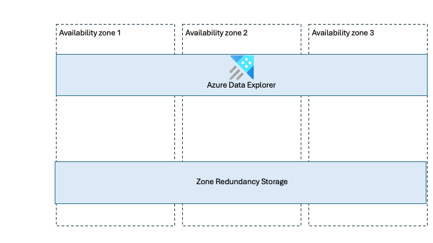

# Reliability in Azure Data Explorer

[Azure Data Explorer](/azure/data-explorer/data-explorer-overview) is a big data analytics service that enables you to ingest, store, and query large volumes of data with low latency. It's commonly used for log analytics, telemetry, and time-series workloads that require fast querying over large datasets.

[!INCLUDE [Shared responsibility](includes/reliability-shared-responsibility-include.md)]

This article describes how to make Azure Data Explorer resilient to various potential outages and problems, including transient faults, availability zone failures, and region-wide failures. It also highlights key information about the Azure Data Explorer service-level agreement (SLA).

## Production deployment recommendations for reliability

To improve the reliability of Azure Data Explorer in production environments, consider the following recommendations:

- **Enable availability zone support where available.**  
  Azure Data Explorer supports availability zones. When availability zone support is enabled, compute nodes are distributed across multiple availability zones and data is stored using zone-redundant storage. This configuration improves resilience to availability zone failures.

- **Plan for reduced capacity during availability zone failures.**  
  When availability zone support is enabled, a zone outage results in the temporary loss of the compute nodes in the affected zone. This reduces the total available capacity of the cluster. If your workload can’t tolerate reduced capacity during a zone outage, deploy other nodes to ensure sufficient headroom.

- **Design explicitly for regional failures.**  
  Azure Data Explorer clusters are deployed into a single Azure region. If that region becomes unavailable, the cluster and its data are unavailable. To mitigate region-wide failures, you must design and operate custom multi-region solutions.

## Reliability architecture overview

Azure Data Explorer has a clear separation between compute and storage, which is central to its reliability model.

The **compute layer** consists of cluster nodes. These nodes are Microsoft-managed virtual machines that handle data ingestion and query processing.

The **storage layer** is built on Azure Storage and is managed by the service. Storage is independent of the compute layer and persists data separately from the cluster nodes.

From a logical perspective, you deploy clusters, which contain databases, which in turn contain tables. This abstraction is sufficient to understand the reliability characteristics of the service without going into low-level implementation details.

<!-- DIAGRAM CALLOUT -->
<!-- Include a high-level reliability architecture diagram showing:
     - An Azure Data Explorer cluster
     - Multiple compute nodes
     - A separate Azure Storage layer
     - Clear separation between compute and storage -->

<!-- TODO mention ingestion -->

## Resilience to transient faults

[!INCLUDE [Resilience to transient faults](includes/reliability-transient-fault-description-include.md)]

<!-- TODO queued ingestion has retry behaviors built in https://learn.microsoft.com/en-us/azure/data-explorer/ingest-data-overview -->

## Resilience to availability zone failures

[!INCLUDE [Resilience to availability zone failures](~/reusable-content/ce-skilling/azure/includes/reliability/reliability-availability-zone-description-include.md)]

> [!WARNING]
> **Note to PG:** Confirm whether availability zone support is still in preview as per the [Migrate your cluster to support multiple availability zones](/azure/data-explorer/migrate-cluster-to-multiple-availability-zone) article.

Azure Data Explorer supports a **zone-redundant deployment model**.

When availability zone support is enabled:
- Compute resources (cluster nodes) are distributed across multiple availability zones.
- Data is stored using Azure Storage zone-redundant storage (ZRS), which synchronously replicates at least 3 copies of the data across availability zones.

Microsoft manages the distribution of resources across availability zones and handles detection and response to availability zone failures.

### Requirements

- **Region support:** Availability zone support is available in [Azure regions that support availability zones](./regions-list.md).

> [!WARNING]
> **Note to PG**: Confirm whether Azure Data Explorer supports all availability zone–capable regions or only a subset. If only a subset, we need to list the supported regions. 

### Considerations

- **Zone selection:** Customers can choose which availability zones to use for compute resources. Storage zone placement is managed by Microsoft.

<!-- Note to PG: Validate that customers can select availability zones for compute while storage zone placement is fully managed by Microsoft. -->

### Cost

Enabling availability zone support incurs extra costs. This is primarily driven by the use of zone-redundant storage, which is billed at a higher rate than locally redundant storage. For more information, see [Azure Data Explorer pricing](https://azure.microsoft.com/pricing/details/data-explorer/).

<!-- Note to PG: Confirm the cost model for availability zone support, especially the impact of using zone-redundant storage. -->

### Configure availability zone support

You can enable availability zone support when you create a new Azure Data Explorer cluster. You can also migrate an existing cluster to use availability zones. For more information, see [Create a cluster and database](/azure/data-explorer/create-cluster-and-database) and [Migrate your cluster to support multiple availability zones](/azure/data-explorer/migrate-cluster-to-multiple-availability-zone).

### Capacity planning and management

When an availability zone becomes unavailable, the nodes in that zone are temporarily unavailable, reducing overall cluster capacity.

If your workload can’t tolerate this reduction, you should overprovision capacity so that sufficient resources remain available during a zone outage. For more information, see [Manage capacity by over-provisioning](/azure/reliability/concept-redundancy-replication-backup#manage-capacity-with-over-provisioning).

### Behavior when all zones are healthy

- **Traffic routing between zones:** During normal operation, Azure Data Explorer uses compute nodes across all available zones for ingestion and query processing. Work is distributed across nodes regardless of their availability zone.

> [!WARNING]
> **Note to PG:** Confirm whether this traffic distribution behavior fully aligns with other Azure compute services.

- **Data replication between zones:** Data is synchronously replicated across availability zones using Azure Storage zone-redundant storage. This provides a high level of data consistency and minimizes the risk of data loss during a zone failure.

### Behavior during a zone failure

- **Detection and response:** Microsoft detects availability zone failures and manages the response for Azure Data Explorer. You don't need to do anything to initiate a zone failover.

[!INCLUDE [Availability zone down notification (Service Health only)](./includes/reliability-availability-zone-down-notification-service-include.md)]

- **Active requests:** Active requests that rely on compute or storage resources in the failed zone might be terminated and should be retried by the client.

  > [!WARNING]
  > **Note to PG:** Confirm how active requests are handled during a zone failure and whether clients should always retry.

- **Expected data loss:** No data loss is expected during an availability zone outage because data is synchronously replicated across zones.

- **Expected downtime:** A brief service interruption might occur while traffic is redirected to healthy availability zones. Ensure that your applications are prepared by following [transient fault handling guidance](#resilience-to-transient-faults).

- **Traffic rerouting:** After a zone failure, Azure Data Explorer routes new requests to compute and storage resources in the remaining healthy zones.

### Zone recovery

When the failed availability zone recovers, Microsoft recreates the cluster nodes in that zone and restores normal traffic distribution across all zones. No customer action is required.

### Test for zone failures

Availability zone failover and recovery for Azure Data Explorer are fully managed by Microsoft. You don’t need to initiate or validate availability zone failure processes.

## Resilience to region-wide failures

Azure Data Explorer is a **single-region service**. Clusters are deployed into a single Azure region, and if that region becomes unavailable, the cluster and its data are unavailable.

To minimize the business impact of a regional outage, you can deploy Azure Data Explorer clusters in multiple regions and implement custom data replication and failover strategies. Existing business continuity and disaster recovery documentation covers these scenarios.

Azure paired regions can be used where appropriate, but they aren’t mandatory. Some regions aren’t paired, and regulatory or geopolitical considerations might make paired regions unsuitable.

### Custom multi-region solutions for resiliency

If you need regional resiliency, deploy independent Azure Data Explorer clusters in multiple regions. You’re responsible for coordinating data replication, traffic routing, and failover between regions.

This approach works in both paired and non-paired regions and provides flexibility for customers with strict regulatory or availability requirements.

For more information see [Outage of an Azure region](/azure/data-explorer/business-continuity-overview#outage-of-an-azure-region).

## Backup and restore

Azure Data Explorer doesn't provide a native backup capability. This design aligns with its role as an analytics service, where data is typically retained in upstream systems such as data lakes and re-ingested into Azure Data Explorer as needed.

## Resilience to service maintenance

No customer actions are required to maintain reliability during service maintenance. Maintenance activities for Azure Data Explorer are managed by Microsoft. <!-- TODO standard wording -->

## Service-level agreement

[!INCLUDE [Service-level agreement](includes/reliability-service-level-agreement-include.md)]

## Related content

- [Reliability in Azure](/azure/reliability)
- [Azure Data Explorer overview](/azure/data-explorer/data-explorer-overview)
