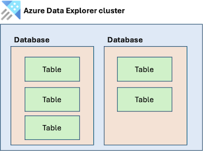
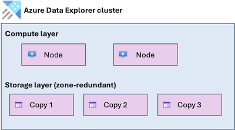

# Reliability in Azure Data Explorer

[Azure Data Explorer](/azure/data-explorer/data-explorer-overview) is a big data analytics service that enables you to ingest, store, and query large volumes of data with low latency. It's commonly used for log analytics, telemetry, and time-series workloads that require fast querying over large datasets.

[!INCLUDE [Shared responsibility](includes/reliability-shared-responsibility-include.md)]

This article describes how to make Azure Data Explorer resilient to various potential outages and problems, including transient faults, availability zone failures, and region-wide failures. It also describes backup and restore options and resilience to service maintenance, and highlights key information about the Azure Data Explorer service-level agreement (SLA).

## Production deployment recommendations for reliability

For production workloads, we recommend that you take the following steps to improve the reliability of your Azure Data Explorer cluster:

> [!div class="checklist"]
> - **Deploy a full cluster.** Azure Data Explorer provides [free clusters](/azure/data-explorer/start-for-free) for trial purposes. For production workloads, deploy a full cluster.
> - **Enable availability zone support.** Azure Data Explorer supports availability zones. When availability zone support is enabled, compute nodes are distributed across multiple availability zones and data is stored using zone-redundant storage. This configuration improves resilience to availability zone failures.

> [!WARNING]
> **Note to PG:** Please verify that the checklist above aligns with what you'd recommend for most customers to do to improve their cluster's reliability.

## Reliability architecture overview

[!INCLUDE [Introduction to reliability architecture overview section](includes/reliability-architecture-overview-introduction-include.md)]

### Logical architecture

The primary resource you deploy is a *cluster*, which represents the infrastructure you need to ingest, store, and query your data. With a cluster, you create *databases*, which in turn contain *tables*.

Clusters perform [ingestion](/azure/data-explorer/ingest-data-overview) to retrieve data from other data sources and load it into a table in the cluster. Data can then be [queried](/azure/data-explorer/integrate-query-overview) by using the Kusto Query Language (KQL) syntax. Clusters also have a set of management operations that you can perform.

### Physical architecture

An Azure Data Explorer cluster has two primary layers that are applicable to its reliability configuration:

- **Compute layer:** Azure Data Explorer is a distributed computing platform and can have two to many node virtual machines (VMs) depending on scale and node role type. Nodes handle data ingestion and query processing work. You don't see or manage the node VMs directly. The platform automatically manages instance creation, health monitoring, and replacement of unhealthy nodes. When your cluster is [configured to use availability zones](#resilience-to-availability-zone-failures), the nodes are spread among different datacenters.

- **Storage layer:** Azure Data Explorer uses Azure Storage as its durable persistence layer. Azure Storage automatically provides fault tolerance, with the default setting offering locally redundant storage (LRS) within a datacenter. Three replicas are persisted. If a replica is lost while in use, another is deployed without disruption. When your cluster is [configured to use availability zones](#resilience-to-availability-zone-failures), the replicas are spread among different datacenters.

For more information, see [How Azure Data Explorer works](/azure/data-explorer/how-it-works).

## Resilience to transient faults

[!INCLUDE [Resilience to transient faults](includes/reliability-transient-fault-description-include.md)]

To build resilience to transient faults when you use Azure Data Explorer, follow these practices:

- When you use queued ingestion, rely on the [built-in retry behavior](/azure/data-explorer/ingest-data-overview).
- Use [Microsoft-provided client libraries and SDKs](/kusto/api/), which automatically retry when transient faults occur.
- If you use Azure Data Explorer APIs directly, retry any queries and management operations that fail due to a transient fault.

## Resilience to availability zone failures

[!INCLUDE [Resilience to availability zone failures](~/reusable-content/ce-skilling/azure/includes/reliability/reliability-availability-zone-description-include.md)]

Azure Data Explorer supports two types of availability zone configuration:

- **Zone-redundant (recommended):** When you enable availability zones on your cluster, your cluster's nodes are spread across multiple zones. Microsoft manages the distribution of nodes across the selected availability zones and handles detection and response to availability zone failures. A zone-redundant cluster is resilient to an availability zone outage.

  When you configure your cluster to be zone-redundant, your data is stored using Azure Storage zone-redundant storage (ZRS), which synchronously replicates at least three copies of the data across multiple availability zones.

  

- **Zonal:** You can optionally select a single zone when you enable availability zones on your cluster. Microsoft places all of your compute notes into that zone. This is a *zonal* (single-zone) cluster.
    
  [!INCLUDE [Zonal resource description](includes/reliability-availability-zone-zonal-include.md)]
  
  Your zone selection only applies to your compute nodes. Even if you select a zonal cluster, your data is stored across multiple zones by using ZRS.

  

If you don't enable availability zones, the cluster is *nonzonal*, which means Azure selects the availability zone for each node and your data. If any availability zone in the region has an outage, it might affect your cluster's nodes, data, or both. We don't recommend a nonzonal configuration because it doesn't provide protection against availability zone outages.

### Requirements

- **Region support:** Availability zone support is available in [Azure regions that support availability zones](./regions-list.md).

  However, some compute node types and sizes are only available in specific regions, or specific zones within a region.

- **Full clusters:** Availability zone support is available with full clusters. It's not available with [free clusters](/azure/data-explorer/start-for-free).

### Considerations

**Zone selection:** For compute nodes, you choose which availability zones to use. Storage zone placement is managed by Microsoft.

### Cost

Enabling availability zone support incurs extra costs for zone-redundant storage, which is billed at a higher rate than locally redundant storage. For more information, see [Azure Storage pricing](https://azure.microsoft.com/pricing/details/storage/blobs/).

Compute nodes are charged at the same rate whether you use availability zone support or not. For more information, see [Azure Data Explorer pricing](https://azure.microsoft.com/pricing/details/data-explorer/).

### Configure availability zone support

- **Create a new cluster with availability zone support:** You can enable availability zone support when you create a new Azure Data Explorer cluster. For more information, see [Create a cluster and database](/azure/data-explorer/create-cluster-and-database).

  When you create an availability zone-enabled cluster by using the Azure portal, it's automatically zone-redundant, and Microsoft selects the zones.

  To select zones yourself, or to create a zonal cluster, use another deployment approach like Azure Resource Manager APIs or Bicep. For most situations, we recommend that you create a zone-redundant cluster and that you use all of the zones in the region.

  > [!NOTE]
  > [!INCLUDE [Availability zone numbering](./includes/reliability-availability-zone-numbering-include.md)]

- **Enable availability zones on an existing cluster (preview):** You can migrate an existing nonzonal cluster to use availability zones. This capability is in preview. For more information, see [Migrate your cluster to support multiple availability zones](/azure/data-explorer/migrate-cluster-to-multiple-availability-zone).

- **Reconfigure availability zones on an existing cluster (preview):** You can change the zones used for a cluster. This capability is in preview. For more information, see [Migrate your cluster to support multiple availability zones](/azure/data-explorer/migrate-cluster-to-multiple-availability-zone).

- **Disable availability zone support on an existing cluster:** After a cluster is configured with availability zones, you can't change the cluster to not use availability zones.

- **Verify availability zone configuration for clusters:** You can use the cluster's *zone status* property (the `zoneStatus` property in the API) to verify the availability zone configuration of a cluster.

  If the value is `Zonal`, it means the cluster has been configured to use availability zones. However, the cluster might be zonal or zone-redundant. To determine which, use the *zones* property. If the zones list has one zone listed, the cluster is zonal (single-zone). If it has multiple zones listed, it's zone-redundant.

### Instance distribution across zones

The cluster's compute layer uses a best-effort approach to evenly spread instances across the zones you select.

### Behavior when all zones are healthy

This section describes what to expect when you configure a cluster for availability zone support, and all zones are operational.

- **Cross-zone operation:** During normal operation, Azure Data Explorer uses all available compute nodes for ingestion, query processing, and other operations. Work is distributed across nodes regardless of their availability zone.

- **Cross-zone data replication:** Data is synchronously replicated across availability zones by using Azure Storage zone-redundant storage. This provides a high level of data consistency and minimizes the risk of data loss during a zone failure.

### Behavior during a zone failure

This section describes what to expect when you configure a cluster for availability zone support, and there's an outage in one of the zones.

- **Detection and response:** Responsibility for detection and response depends on the availability zone configuration that your cluster uses.

  - *Zone-redundant:* Microsoft detects availability zone failures and manages the response for Azure Data Explorer. You don't need to do anything to initiate a zone failover.

  - *Zonal:* You're responsible for detecting a failure that affects your cluster's availability zone. You're also responsible for any response you decide to initiate, such as switching to a second cluster you previously created in a different availability zone.

[!INCLUDE [Availability zone down notification (Service Health only)](./includes/reliability-availability-zone-down-notification-service-include.md)]

- **Active requests:** Active requests that rely on compute or storage resources in the failed zone might be terminated and should be retried by the client. Ensure that your applications are prepared by following [transient fault handling guidance](#resilience-to-transient-faults).

- **Expected data loss:** No data loss is expected during an availability zone outage because data is synchronously replicated across zones.

- **Expected downtime:** The expected downtime depends on the availability zone configuration that your cluster uses.

  - *Zone-redundant:* A brief service interruption might occur while traffic is redirected to healthy availability zones. Ensure that your applications are prepared by following [transient fault handling guidance](#resilience-to-transient-faults).

      When an availability zone is unavailable, any nodes in that zone might be temporarily unavailable, which reduces your cluster's compute capacity until the zone recovers.

  - *Zonal:* Your cluster's compute nodes are unavailable until the availability zone recovers. You also might not be able to access your cluster's data during a zone failure.

- **Redistribution:** The traffic rerouting behavior depends on the availability zone configuration that your cluster uses. 

  - *Zone-redundant:* Azure Data Explorer routes new requests to compute and storage resources in the remaining healthy zones.

  - *Zonal:* Your cluster is unavailable until the availability zone recovers.

### Zone recovery

When the failed availability zone recovers, Microsoft recreates the cluster nodes in that zone and restores normal traffic distribution across all zones. No customer action is required.

### Test for zone failures

The options for testing for zone failures depend on the availability zone configuration that your cluster uses.

- *Zone-redundant:* Availability zone failover and recovery for Azure Data Explorer are fully managed by Microsoft. You don’t need to initiate or validate availability zone failure processes.

- *Zonal:* To partially simulate the loss of all of the compute nodes during a zone outage, you can stop your cluster. You can use this approach to validate parts of your own zone-down detection and failover processes.

## Resilience to region-wide failures

An Azure Data Explorer cluster is deployed into a single Azure region. If that region becomes unavailable, the cluster and its data are unavailable.

### Custom multi-region solutions for resiliency

To minimize the business impact of a region outage, you can deploy separate Azure Data Explorer clusters in multiple regions. Each cluster is independent, and you’re responsible for managing each cluster, and for coordinating data replication, traffic routing, and failover between regions.

You can decide between different types of multi-region cluster configurations, which each support different levels of recovery time, potential data loss, effort, and cost. You can select Azure regions for each cluster that support your latency and data residency requirements. For more information about multi-region cluster configurations and patterns you can follow, see [Outage of an Azure region](/azure/data-explorer/business-continuity-overview#outage-of-an-azure-region).

## Backup and restore

[!INCLUDE [Backups description](includes/reliability-backups-include.md)]

Azure Data Explorer doesn't provide a native backup and restore capability. If you need to perform backups of your data, you can consider the following approaches:

- [Continuous export](/kusto/management/data-export/continuous-data-export), which periodically exports data to external storage, and supports *exactly once* export of supported data.
- [Data export to cloud storage](/kusto/management/data-export/export-data-to-storage), which enables you to manually export data to external storage.
- Ingest data to Azure Data Explorer from an upstream source, like a data lake, that you can back up separately.

## Resilience to accidental deletion

Azure Data Explorer includes several mechanisms to help you protect against accidental deletion of clusters, databases, tables, and external tables:

- **Accidental cluster or database deletion:** Accidental cluster or database deletion is an irrecoverable action. You can prevent data loss by enabling a [delete lock](/azure/azure-resource-manager/management/lock-resources) on the cluster or database resource.

- **Accidental table deletion:** Users with table admin permissions or higher are allowed to [drop tables](/kusto/management/drop-table-command?view=azure-data-explorer&preserve-view=true). If one of those users accidentally drops a table, you can recover it using the [`.undo drop table`](/kusto/management/undo-drop-table-command?view=azure-data-explorer&preserve-view=true) command. For this command to be successful, you must first enable the *recoverability* property in the [retention policy](/kusto/management/retention-policy?view=azure-data-explorer&preserve-view=true).

- **Accidental external table deletion:** [External tables](/kusto/query/schema-entities/external-tables?view=azure-data-explorer&preserve-view=true) are Kusto query schema entities that reference data stored outside the database. Deletion of an external table only deletes the table metadata. You can recover it by re-executing the table creation command.

  For Azure Blob Storage and Azure Data Lake external tables, use the [soft delete](/azure/storage/blobs/storage-blob-soft-delete) capability to protect against accidental deletion or overwrite of a blob for a user-configured amount of time.

## Resilience to service maintenance

Azure Data Explorer regularly applies service updates and performs routine maintenance. The Azure platform handles these activities automatically while remaining within the availability levels specified in the SLA. Ensure that your applications are prepared by following [transient fault handling guidance](#resilience-to-transient-faults).

To learn about upcoming maintenance, use [Azure Service Health](/azure/service-health/service-health-planned-maintenance).

## Service-level agreement

[!INCLUDE [Service-level agreement](includes/reliability-service-level-agreement-include.md)]

To be eligible for the Azure Data Explorer availability SLA, your application needs to [handle transient faults by retrying failed requests](#resilience-to-transient-faults).

## Related content

- [Reliability in Azure](/azure/reliability)
- [Azure Data Explorer overview](/azure/data-explorer/data-explorer-overview)
- [Business continuity and disaster recovery overview](/azure/data-explorer/business-continuity-overview)
