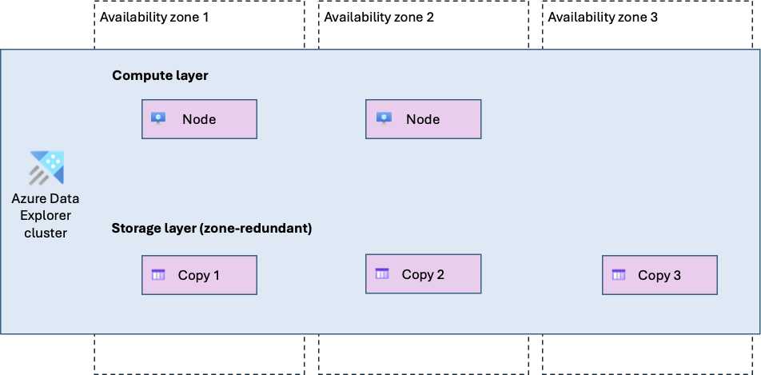

# Reliability in Azure Data Explorer

[Azure Data Explorer](/azure/data-explorer/data-explorer-overview) is a big data analytics service that enables you to ingest, store, and query large volumes of data with low latency. It's commonly used for log analytics, telemetry, and time-series workloads that require fast querying over large datasets.

[!INCLUDE [Shared responsibility](includes/reliability-shared-responsibility-include.md)]

This article describes how to make Azure Data Explorer resilient to various potential outages and problems, including transient faults, availability zone failures, and region-wide failures. It also describes backup and restore options and resilience to service maintenance, and highlights key information about the Azure Data Explorer service-level agreement (SLA).

## Production deployment recommendations for reliability

For production workloads, we recommend that you take the following steps to improve the reliablity of your Azure Data Explorer cluster:

> [!div class="checklist"]
> - **Deploy a full cluster.** Azure Data Explorer provides [free clusters](/azure/data-explorer/start-for-free) for trial purposes. For production workloads, deploy a full cluster.
> - **Enable availability zone support.** Azure Data Explorer supports availability zones. When availability zone support is enabled, compute nodes are distributed across multiple availability zones and data is stored using zone-redundant storage. This configuration improves resilience to availability zone failures.

## Reliability architecture overview

Azure Data Explorer has a clear separation between compute and storage, which is central to its reliability model.

The **compute layer** consists of cluster nodes. These nodes are Microsoft-managed virtual machines that handle data ingestion and query processing.

The **storage layer** is built on Azure Storage and is managed by the service. Storage is independent of the compute layer and persists data separately from the cluster nodes.

<!-- Note: Azure Data Explorer depends on Azure Storage. For information about the reliability of Azure Storage, see [Reliability in Azure Storage](/azure/reliability/reliability-storage-accounts). The storage redundancy configuration for your Azure Data Explorer cluster affects the overall reliability of your data. -->

From a logical perspective, you deploy clusters, which contain databases, which in turn contain tables. This abstraction is sufficient to understand the reliability characteristics of the service without going into low-level implementation details.

<!-- DIAGRAM CALLOUT -->
<!-- Include a high-level reliability architecture diagram showing:
     - An Azure Data Explorer cluster
     - Multiple compute nodes
     - A separate Azure Storage layer
     - Clear separation between compute and storage -->

<!-- TODO: Mention ingestion and how it relates to reliability. See https://learn.microsoft.com/en-us/azure/data-explorer/ingest-data-overview -->

## Resilience to transient faults

[!INCLUDE [Resilience to transient faults](includes/reliability-transient-fault-description-include.md)]

<!-- TODO: This section needs service-specific guidance on transient fault handling. Areas to cover include:
     - Built-in retry behavior for queued ingestion (see https://learn.microsoft.com/en-us/azure/data-explorer/ingest-data-overview)
     - Recommended retry strategies for queries and management operations
     - How clients should handle transient connection failures
     - Any circuit breaker or throttling behaviors customers should be aware of
     
     Please provide details on Microsoft's responsibilities (built-in retries, automatic recovery) vs. customer responsibilities (implementing client-side retries, configuring timeouts). -->

## Resilience to availability zone failures

[!INCLUDE [Resilience to availability zone failures](~/reusable-content/ce-skilling/azure/includes/reliability/reliability-availability-zone-description-include.md)]

Azure Data Explorer supports two types of availability zone configuration:

- **Zone-redundant (recommended):** When you enable availability zones on your cluster, you can select multiple availability zones for your cluster's nodes. Microsoft manages the distribution of resources across the selected availability zones and handles detection and response to availability zone failures.

  When you configure your cluster to be zone-redundant, your data is stored using Azure Storage zone-redundant storage (ZRS), which synchronously replicates at least 3 copies of the data across multiple availability zones.

   <!-- TODO redo -->

- **Zonal:** You can optionally enable availability zones on your cluster and select a single zone. Microsoft places all of your compute notes into that zone.
    
  [!INCLUDE [Zonal resource description](includes/reliability-availability-zone-zonal-include.md)]
  
  Your zone selection only applies to your compute nodes. Even if you select a zonal cluster, your data is stored in ZRS.

   <!-- TODO new diagram required -->

If you don't enable availability zones, the cluster is *nonzonal*, which means Azure selects the availability zone for each node and your data. If any availability zone in the region has an outage, it might affect your cluster or data. We don't recommend a nonzonal configuration because it doesn't provide protection against availability zone outages.

### Requirements

- **Region support:** Availability zone support is available in [Azure regions that support availability zones](./regions-list.md).

  However, some compute node types and sizes are only available in specific regions, or specific zones within a region.

- **Full clusters:** Availability zone support is available with full clusters. It's not available with [free clusters](/azure/data-explorer/start-for-free).

### Considerations

**Zone selection:** For compute nodes, you choose which availability zones to use. Storage zone placement is managed by Microsoft.

### Cost

Enabling availability zone support incurs extra costs for zone-redundant storage, which is billed at a higher rate than locally redundant storage. For more information, see [Azure Storage pricing](https://azure.microsoft.com/pricing/details/storage/blobs/).

Compute nodes are charged at the same rate whether you use availability zone support or not. For more information, see [Azure Data Explorer pricing](https://azure.microsoft.com/pricing/details/data-explorer/).

### Configure availability zone support

- **Create a new cluster with availability zone support:** You can enable availability zone support when you create a new Azure Data Explorer cluster. For more information, see [Create a cluster and database](/azure/data-explorer/create-cluster-and-database).

  When you create an availability zone-enabled cluster by using the Azure portal, it's automatically zone-redundant, and Microsoft selects the zones.

  To select zones yourself, or to create a zonal cluster, use another deployment approach like Azure Resource Manager APIs or Bicep.

  > [!NOTE]
  > [!INCLUDE [Availability zone numbering](./includes/reliability-availability-zone-numbering-include.md)]

- **Enable availability zones on an existing cluster (preview):** You can also migrate an existing cluster to use availability zones. This capability is in preview. For more information, see [Migrate your cluster to support multiple availability zones](/azure/data-explorer/migrate-cluster-to-multiple-availability-zone).

- **Reconfigure availability zones on an existing cluster (preview):** You can change the zones used for a cluster. This capability is in preview. For more information, see [Migrate your cluster to support multiple availability zones](/azure/data-explorer/migrate-cluster-to-multiple-availability-zone).

- **Disable availability zone support on an existing cluster:** Once a cluster is configured with availability zones, you can't change the cluster to not use availability zones.

### Capacity planning and management

When an availability zone becomes unavailable, any nodes in that zone might be temporarily unavailable, which reduces your cluster's compute capacity until the zone recovers.

### Behavior when all zones are healthy

- **Cross-zone operation:** During normal operation, Azure Data Explorer uses all available compute nodes for ingestion, query processing, and other operations. Work is distributed across nodes regardless of their availability zone.

- **Cross-zone data replication:** Data is synchronously replicated across availability zones using Azure Storage zone-redundant storage. This provides a high level of data consistency and minimizes the risk of data loss during a zone failure.

### Behavior during a zone failure

- **Detection and response:** Responsibility for detection and response depends on the availability zone configuration that your cluster uses.

  - *Zone-redundant:* Microsoft detects availability zone failures and manages the response for Azure Data Explorer. You don't need to do anything to initiate a zone failover.

  - *Zonal:* You're responsible for detecting an failure that affects your cluster's availabilty zone. You're also responsible for any response you decide to initiate, such as switching to a second cluster you previously created in a different availability zone.

[!INCLUDE [Availability zone down notification (Service Health only)](./includes/reliability-availability-zone-down-notification-service-include.md)]

- **Active requests:** Active requests that rely on compute or storage resources in the failed zone might be terminated and should be retried by the client.

- **Expected data loss:** No data loss is expected during an availability zone outage because data is synchronously replicated across zones.

- **Expected downtime:** The expected downtime depends on the availability zone configuration that your cluster uses.

  - *Zone-redundant:* A brief service interruption might occur while traffic is redirected to healthy availability zones. Ensure that your applications are prepared by following [transient fault handling guidance](#resilience-to-transient-faults).

  - *Zonal:* Your cluster's compute nodes are unavailable until the availabilty zone recovers.

- **Redistribution:** The traffic rerouting behavior depends on the availability zone configuration that your cluster uses. 

  - *Zone-redundant:* Azure Data Explorer routes new requests to compute and storage resources in the remaining healthy zones.

  - *Zonal:* Your cluster's compute nodes are unavailable until the availabilty zone recovers.

### Zone recovery

When the failed availability zone recovers, Microsoft recreates the cluster nodes in that zone and restores normal traffic distribution across all zones. No customer action is required.

### Test for zone failures

The options for testing for zone failures depend on the availability zone configuration that your cluster uses.

- *Zone-redundant:* Availability zone failover and recovery for Azure Data Explorer are fully managed by Microsoft. You don’t need to initiate or validate availability zone failure processes.

- *Zonal:* To partially simulate the loss of all of the compute nodes during a zone outage, you can stop your cluster.

## Resilience to region-wide failures

An Azure Data Explorer cluster is deployed into a single Azure region. If that region becomes unavailable, the cluster and its data are unavailable.

### Custom multi-region solutions for resiliency

To minimize the business impact of a region outage, you can deploy separate Azure Data Explorer clusters in multiple regions. Each cluster is independent, and you’re responsible for coordinating data replication, traffic routing, and failover between regions.

You can decide between different types of multi-region cluster configurations, which each support different levels of recovery time, potential data loss, effort, and cost. You can select Azure regions for each cluster that support your latency and data residency requirements.

For more information about multi-region cluster configurations and patterns you can follow, see [Outage of an Azure region](/azure/data-explorer/business-continuity-overview#outage-of-an-azure-region).

## Backup and restore

[!INCLUDE [Backups description](includes/reliability-backups-include.md)]

Azure Data Explorer doesn't provide a native backup and restore capability. If you need to perform backups of your data, you can consider the following approaches:

- [Continuous export](/kusto/management/data-export/continuous-data-export), which periodically exports data to external storage, and supports *exactly once* export of supported data.
- [Data export to cloud storage](/kusto/management/data-export/export-data-to-storage), which enables you to manually export data to external storage.
- Ingest data from an upstream source, like a data lake, that you can back up.

## Resilience to service maintenance

[!INCLUDE [Service maintenance (no special callouts)](includes/reliability-maintenance-include.md)]

<!-- TODO -->

## Resilience to accidental deletion

<!-- TODO -->

## Service-level agreement

[!INCLUDE [Service-level agreement](includes/reliability-service-level-agreement-include.md)]

## Related content

- [Reliability in Azure](/azure/reliability)
- [Azure Data Explorer overview](/azure/data-explorer/data-explorer-overview)
- [Business continuity and disaster recovery overview](/azure/data-explorer/business-continuity-overview)
