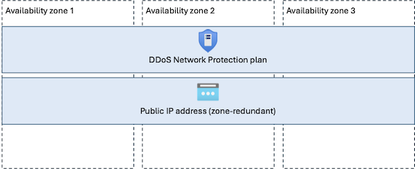

# Reliability in Azure DDoS Protection

[Azure DDoS Protection](/azure/ddos-protection/ddos-protection-overview) is a foundational Azure networking capability that helps protect applications from distributed denial-of-service (DDoS) attacks. DDoS attacks attempt to overwhelm applications with traffic in order to deny service to legitimate users. Azure DDoS Protection helps safeguard applications by monitoring network traffic patterns and automatically mitigating abnormal traffic that could impact availability.

[!INCLUDE [Shared responsibility](includes/reliability-shared-responsibility-include.md)]

This article describes how Azure DDoS Protection is resilient to a variety of potential outages and problems, including transient faults, availability zone outages, and region outages. It also highlights some key information about the Azure DDoS Protection service level agreement (SLA).

> [!NOTE]
> This document describes how the Azure DDoS Protection service itself is resilient to various issues. It doesn't explain how to use Azure DDoS Protection to protect your VMs or other assets. To learn about how to use Azure DDoS Protection to protect your workloads, see [Azure DDoS Protection fundamental best practices](/azure/ddos-protection/fundamental-best-practices).

## Reliability architecture overview

You deploy Azure DDoS Protection using one of these tiers:

- **DDoS Network Protection:** Deploy a *DDoS protection plan*, which defines a set of virtual networks that have DDoS Network Protection enabled, even if they're in different Azure subscriptions and regions. Each public IP address associated with resources in those virtual networks is protected by the plan.
- **DDoS IP Protection:** Deploy a public IP address, which can then have DDoS IP protection enabled just on that IP address.

For more information about the difference between DDoS Network Protection and DDoS IP Protection, see [About Azure DDoS Protection Tier Comparison](/azure/ddos-protection/ddos-protection-sku-comparison).

## Resilience to transient faults

[!INCLUDE [Resilience to transient faults](includes/reliability-transient-fault-description-include.md)]

Enabling DDoS protection doesn't change the way your applications handle transient faults.

## Resilience to availability zone failures

[!INCLUDE [Resilience to availability zone failures](~/reusable-content/ce-skilling/azure/includes/reliability/reliability-availability-zone-description-include.md)]

Azure DDoS Protection is zone-redundant by default in regions that support availability zones. The service spans all availability zones automatically and requires no customer configuration to enable zone redundancy. Microsoft manages the distribution of DDoS Protection infrastructure across zones.

For your workload to be resilient to availability zone failures, you must also configure your your public IP addresses to be zone-redundant, and ensure your backend servers or other resources are zone-resilient.

The following diagram shows a zone-redundant DDoS Network Protection plan and multiple protected zone-redundant public IP addresses:

### Requirements

**Region support:** Azure DDoS Protection is zone-redundant in [any region that supports availability zones](/azure/reliability/regions-list).

### Cost

There's no additional cost to enable zone redundancy for Azure DDoS Protection. For more information about pricing, see [Azure DDoS Protection pricing](https://azure.microsoft.com/pricing/details/ddos-protection/).

### Configure availability zone support

Azure DDoS Protection is automatically zone-redundant in supported regions. There's no configuration required to enable zone redundancy, and you can't disable it.

### Behavior when all zones are healthy

This section describes what to expect when you deploy a DDoS Protection plan in a region with availability zones, the public IP address is zone-redundant, and all availability zones are operational.

- **Traffic routing between zones:** Traffic inspection can occur in all zones, and traffic is routed between zones transparently as part of Azure networking operations.

- **Data replication between zones:** Azure DDoS Protection doesn't replicate customer data between zones because the service is stateless and doesn't maintain customer data.

### Behavior during a zone failure

This section describes what to expect when you deploy a DDoS Protection plan in a region with availability zones, the public IP address is zone-redundant, and there's an outage in one of the availability zones.

- **Detection and response:** Microsoft detects availability zone failures and manages all response actions. You don't need to take any action to initiate a zone failover.

[!INCLUDE [Availability zone down notification (Service Health only)](./includes/reliability-availability-zone-down-notification-service-include.md)]

- **Active requests:** Active traffic continues to be processed automatically with no customer action required.

- **Expected data loss:** No data loss is expected because the service is stateless and doesn't store customer data.

- **Expected downtime:** No downtime is expected to the DDoS Protection plan, and it continues operating using the remaining healthy zones.

- **Traffic rerouting:** Microsoft automatically reroutes traffic protection through the healthy zones.

### Zone recovery

When a failed availability zone recovers, Azure DDoS Protection automatically restores normal operations without customer intervention.

### Test for zone failures

Azure DDoS Protection is a fully Microsoft-managed, zone-redundant service. Because Microsoft manages zone redundancy, you don't need to test availability zone failover scenarios. 

## Resilience to region-wide failures

The behavior of Azure DDoS Protection during region-wide failures is different depending on the type of DDoS protection you use:

- **DDoS IP Protection** is configured on a single public IP address.

  For regional public IP addresses, if there's a region-wide failure, the IP address and its servers are likely to be unavailable.

  For global public IP addresses, the IP address remains protected by DDoS IP Protection even when a region fails.

- **DDoS Network Protection plans** are deployed into a single Azure region. However, the protection applies at the platform level and protects public IP addresses regardless of which region those IP addresses are in.

  If the region hosting a DDoS Network Protection plan becomes unavailable, protected public IP addresses in other regions continue to be protected.

  > [!WARNING]
  > **Note to PG:** Please confirm the above statement.

## Service-level agreement

[!INCLUDE [Service-level agreement](includes/reliability-service-level-agreement-include.md)]

Azure DDoS Protection provides an SLA that covers the availability of the DDoS mitigation service to protect against an attack.

## Related content

- [Azure DDoS Protection overview](/azure/ddos-protection/ddos-protection-overview)
- [Reliability in Azure](/azure/reliability/overview)
