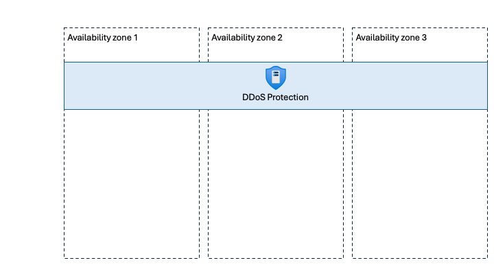

# Reliability in Azure DDoS Protection

Azure Distributed Denial of Service (DDoS) Protection is a foundational Azure networking capability that helps protect applications from distributed denial-of-service (DDoS) attacks. DDoS attacks attempt to overwhelm applications with traffic in order to deny service to legitimate users.

> [Azure DDoS Protection](/azure/ddos-protection/ddos-protection-overview) helps safeguard applications by monitoring network traffic patterns and automatically mitigating abnormal traffic that could impact availability.

[!INCLUDE [Shared responsibility](includes/reliability-shared-responsibility-include.md)] 

This article describes how Azure DDoS Protection contributes to workload resilience, including how the service behaves during transient faults, availability zone outages, and region outages.

## Production deployment recommendations

<!--- Note for John: I can't find a DDoS Article that we usually link to in this section in the WAF documention--->
To ensure high reliability for your production Azure DDoS Protection instances, we recommend that you:

- **Enable Azure DDoS Protection plans for exposed workloads.**  
  Azure provides a baseline level of DDoS protection for all customers, but workloads with public endpoints can benefit from extra tuning and protection by enabling a DDoS Protection plan.

- **Choose the appropriate protection scope.**  
  Use **DDoS IP Protection** for individual public IP addresses and **DDoS Network Protection** to protect multiple IP addresses associated with a virtual network.

- **Treat DDoS Protection as one component of a broader reliability strategy.**  
  DDoS Protection helps preserve availability during attack scenarios but should be combined with other reliability practices such as capacity planning and multi-region architectures.

## Reliability architecture overview

Azure DDoS Protection operates as part of the Azure networking fabric rather than as a customer-deployed resource. Enabling the service reconfigures underlying Azure network infrastructure rather than provisioning dedicated customer instances.

Key architectural characteristics include:

- **Built into the Azure platform fabric**, making it a highly resilient, foundational service.
- **Shared, Microsoft-managed infrastructure**, rather than customer-isolated compute.
- **Largely stateless request processing**, with traffic analysis and model training occurring outside the hot path.

<!--- Include a high-level architecture diagram showing DDoS Protection spanning availability zones -->

## Resilience to transient faults

[!INCLUDE [Resilience to transient faults](includes/reliability-transient-fault-description-include.md)]

Azure DDoS Protection runs at the network fabric layer, and the source material doesn't identify service-specific transient fault scenarios that require customer action.

- Transient faults may occur in the broader Azure networking stack, but no DDoS-specific retry or mitigation logic is required from customers.
- Customers don't implement retry logic directly against Azure DDoS Protection.

## Resilience to availability zone failures

[!INCLUDE [Resilience to availability zone failures](includes/reliability-availability-zone-zonal-include.md)]

Azure DDoS Protection is **zone-redundant by default** in regions that support availability zones. The service spans all availability zones automatically and requires no customer configuration to enable zone redundancy.

### Requirements

- **Region support:** Azure DDoS Protection is zone-redundant in any Azure region that supports availability zones.
- **SKU requirements:** There are no SKU-specific requirements for availability zone support.

### Considerations

- Customers can't pin Azure DDoS Protection to a specific availability zone.
- Microsoft manages availability zone behavior.

### Behavior when all zones are healthy

- **Traffic routing between zones:** Traffic inspection and mitigation may occur across zones transparently as part of Azure networking operations.
- **Data replication between zones:** Azure DDoS Protection doesn't replicate customer data between zones because the service doesn't maintain customer state.

### Behavior during a zone failure

- **Detection and response:** Microsoft detects availability zone failures and manages all response actions.
- **Notification:** Customers can monitor Azure Service Health for service-level notifications. Azure DDoS Protection doesn't expose a Resource Health signal.
- **Active requests:** Active traffic is handled automatically with no customer action required.
- **Expected data loss:** None. The service doesn't store customer data.
- **Expected downtime:** None expected.
- **Traffic rerouting:** Traffic protection continues using the remaining healthy zones.

### Zone recovery

When a failed availability zone recovers, Azure DDoS Protection automatically restores normal operations without customer intervention. 

### Test for zone failures

Azure DDoS Protection is a fully Microsoft-managed, zone-redundant service. Customers don't need to test availability zone failover scenarios. 

## Resilience to region-wide failures

Azure DDoS Protection plans are deployed into a single region but apply to protected IP addresses regardless of the region in which those IP addresses exist. 

### Requirements

- **Region support:** DDoS Protection plans can protect resources across regions, independent of the region where the plan itself is deployed. 

### Considerations

- If a region hosting a protected resource becomes unavailable, that resource is unavailable regardless of DDoS Protection.
- DDoS Protection continues to operate for protected resources in other regions. 

### Behavior when all regions are healthy

- **Traffic routing between regions:** Azure DDoS Protection doesn't control cross-region traffic routing.
