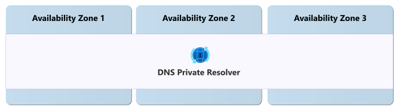

# Reliability in Azure DNS Private Resolver

[Azure DNS Private Resolver](/azure/dns/dns-private-resolver-overview) is a managed service that enables DNS resolution between on-premises environments and Azure DNS private zones without requiring virtual machine-based DNS servers. You can configure conditional forwarding to on-premises, multicloud, and public DNS servers.

[!INCLUDE [Shared responsibility](includes/reliability-shared-responsibility-include.md)]

This article describes how to make DNS Private Resolver resilient to potential outages and disruptions, including transient faults, availability zone failures, and region-wide failures. It also describes backup and restore considerations and service maintenance behavior.

## Reliability architecture overview

When you work with DNS Private Resolver, you deploy a *private resolver* into an Azure virtual network. Then you configure *endpoints*, which receive and forward DNS queries to and from on-premises, and *forwarding rules*, which define the forwarding behavior. For more information, see [DNS Private Resolver endpoints and rulesets](/azure/dns/private-resolver-endpoints-rulesets).

Microsoft is responsible for the availability and health of the managed resolver service and its platform operations. You're responsible for designing endpoint and ruleset topology, configuring DNS forwarding logic, and ensuring your network connectivity path supports your reliability requirements.

Your end-to-end reliability also depends on dependent services and network architecture decisions. For example, your private DNS zones, virtual network configuration, firewall rules, on-premises infrastructure, and hybrid connectivity setup directly affect name resolution outcomes during failures.

## Resilience to transient faults

[!INCLUDE [Resilience to transient faults](includes/reliability-transient-fault-description-include.md)]

If a transient fault occurs during DNS resolution, the DNS client or intermediate resolver should retry DNS queries. Configure timeout values appropriately - between 2 and 5 seconds is usually a sufficient timeout for a DNS client.

Each DNS record’s time to live (TTL) also affects how your solution handles faults. If the TTL is very low, clients need to make more DNS resolution requests and there are more potential opportunities for transient faults to arise. If the TTL is very high, in the event of a true fault in a backend server that requires you to redirect to a different IP address, clients might experience delays in failover until the TTL expires. Configure TTLs carefully to balance availability, latency, and responsiveness.

## Resilience to availability zone failures

[!INCLUDE [Resilience to availability zone failures](~/reusable-content/ce-skilling/azure/includes/reliability/reliability-availability-zone-description-include.md)]

DNS Private Resolver is zone-redundant automatically in regions that support availability zones. Microsoft provisions the service across all of the zones in those regions.

### Requirements

**Region support:** DNS Private Resolver provides automatic zone redundancy in [regions that support availability zones](regions-list.md).

### Cost

There's no extra cost to enable zone redundancy for DNS Private Resolver. For more information about pricing, see [Azure DNS pricing](https://azure.microsoft.com/pricing/details/dns/).

### Configure availability zone support

DNS Private Resolver is automatically zone-redundant in supported regions. There's no configuration required to enable zone redundancy, and you can't disable it. For deployment steps, see [Quickstart: Create an DNS Private Resolver using the Azure portal](/azure/dns/dns-private-resolver-get-started-portal).

### Behavior when all zones are healthy

This section describes what to expect when you deploy DNS Private Resolver in a region with availability zones and all zones are operational.

- **Cross-zone operation:** DNS Private Resolver runs infrastructure across multiple zones, and routes requests automatically among zones.

- **Cross-zone data replication:** DNS Private Resolver doesn't replicate customer data between zones because the service is stateless and doesn't maintain customer data.

### Behavior during a zone failure

This section describes what to expect when you deploy DNS Private Resolver in a region with availability zones and one zone has an outage.

- **Detection and response:** Microsoft detects availability zone failures and manages all response actions. You don't need to take any action to initiate a zone failover.

[!INCLUDE [Availability zone down notification (Service Health and Resource Health)](./includes/reliability-availability-zone-down-notification-service-resource-include.md)]

- **Active requests:** In-flight DNS queries that use affected infrastructure might fail or time out and should be retried. If clients handle [transient faults](#resilience-to-transient-faults) appropriately, they typically avoid significant impact.

- **Expected data loss:** No data loss is expected because the service is stateless and doesn't store customer data.

- **Expected downtime:** A small amount of downtime might occur while the service shifts requests to healthy zone infrastructure. This downtime is typically a few seconds.

- **Redistribution:** Microsoft automatically reroutes DNS resolution requests through the healthy zones.

### Zone recovery

When a failed availability zone recovers, DNS Private Resolver automatically restores normal operations without customer intervention.

### Test for zone failures

DNS Private Resolver is a fully Microsoft-managed, zone-redundant service. Because Microsoft manages zone redundancy, you don't need to test availability zone failover scenarios.

## Resilience to region-wide failures

DNS Private Resolver is a single-region service. If the region becomes unavailable, your private resolver is also unavailable.

### Custom multiregion solutions for resiliency

To improve your resilience to region-wide failures, you can deploy multiple private resolvers in separate regions. Then, configure forwarding and traffic patterns to support failover between regions. For detailed steps, see [Set up DNS failover using private resolvers](/azure/dns/tutorial-dns-private-resolver-failover).

## Backup and restore

DNS Private Resolver doesn't store customer data and doesn't require backup or restore. To recreate configurations, consider maintaining infrastructure as code (IaC) templates for networking resources. Private resolvers are configuration-only and store no customer data, so focus backup efforts on IaC templates for rapid redeployment of your resolver, endpoint settings, DNS forwarding rulesets, and other resources.

## Resilience to service maintenance

[!INCLUDE [Service maintenance (no special callouts)](includes/reliability-maintenance-include.md)]

## Service-level agreement

[!INCLUDE [SLA description](includes/reliability-service-level-agreement-include.md)]

DNS Private Resolver provides an availability SLA for DNS query responses, as long as clients retry failed requests repeatedly.

## Related content

- [What is DNS Private Resolver?](/azure/dns/dns-private-resolver-overview)
- [Set up DNS failover using private resolvers](/azure/dns/tutorial-dns-private-resolver-failover)
- [Reliability in Azure](./overview.md)
