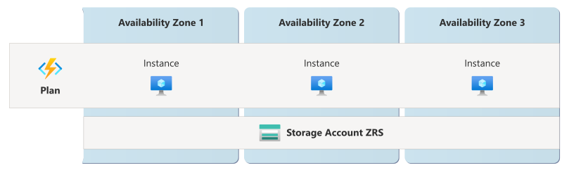
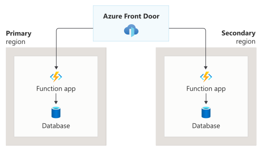
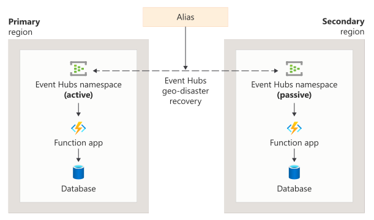

# Reliability in Azure Functions

[Azure Functions](/azure/azure-functions/functions-overview) is an event-driven compute service that lets you run small blocks of code (functions) without having to explicitly provision or manage infrastructure. Functions can respond to events such as HTTP requests, timers, queue messages, and changes in other Azure services, making it well-suited for processing data, integrating systems, and running background tasks.

[!INCLUDE [Shared responsibility](includes/reliability-shared-responsibility-include.md)]

This article describes how to make Azure Functions resilient to various potential outages and problems, including transient faults, availability zone failures, and region-wide failures. It also highlights key information about the Azure Functions service level agreement (SLA).

## Production deployment recommendations

The Azure Well-Architected Framework provides recommendations across reliability, performance, security, cost, and operations. To understand how these areas influence each other and contribute to a reliable Azure Functions solution, see [Architecture best practices for Azure Functions](/azure/well-architected/service-guides/azure-functions).

## Reliability architecture overview

When you deploy Azure Functions, it's important to be familiar with several concepts:

- **[Hosting plans](/azure/azure-functions/functions-scale):** Plans represent the hosting environment for your function apps. The plan determines the compute resources available, the pricing model, and the scaling behavior.

- **[Storage accounts](/azure/azure-functions/storage-considerations):** When you create a function app, you must specify a host storage account. The storage account is used to manage aspects of the function app's internal operations, including function code storage, logging, and concurrency management (such as blob leases for certain trigger types).

    You can also use a storage account for deployment. This storage account might be the same as your host storage account or a different storage account.

    > [!IMPORTANT]
    > The storage accounts are critical parts of your Azure Functions reliability architecture, and you should configure them to meet your function app's resiliency requirements.

- **[Triggers and bindings](/azure/azure-functions/functions-triggers-bindings)**: These enable your function to respond to events, receive, and write data from other services.

- **[Durable Functions](/azure/azure-functions/durable/durable-functions-overview):** Durable functions are stateful functions, including long-running orchestrations and stateful entities.

    When you use Durable Functions, you configure a [storage provider](/azure/azure-functions/durable/durable-functions-storage-providers), which stores the state. You need to evaluate the reliability characteristics of the state store you choose, and configure it to meet your resiliency requirements.

## Resilience to transient faults

[!INCLUDE [Resilience to transient faults](includes/reliability-transient-fault-description-include.md)]

Consider the following recommendations for handling transient faults in your function apps:

- **Triggers and bindings:** The Azure Functions platform includes built-in transient fault handling for many triggers and bindings. When a transient fault occurs while a supported trigger is firing or a supported binding is reading or writing data, the platform can automatically retry the operation. This built-in retry behavior helps ensure that temporary connectivity issues or service blips don't prevent your function from executing. For more information, see [Azure Functions error handling and retries](/azure/azure-functions/functions-bindings-error-pages#retries).

    However, this protection only covers transient faults. Persistent failures, such as a misconfigured connection string or a deleted resource, aren't retried.

    Persistent failures, and repeated transient failures, are treated as errors, and you can configure logging to capture information about function execution errors. For more information, see [How to configure monitoring for Azure Functions](/azure/azure-functions/configure-monitoring).

- **Your function code:** Within the body of your function, you're responsible for handling transient faults when you make calls to external services. You should implement retry logic, timeouts, and circuit breaker patterns as appropriate for any external service calls made in your function code. Design your functions to be idempotent wherever possible, so that retries don't cause duplicate side effects.

- **Clients:** Any client applications that connect to functions synchronously, such as by using an HTTP connection, should be resilient to transient faults.

## Resilience to availability zone failures

[!INCLUDE [Resilience to availability zone failures](~/reusable-content/ce-skilling/azure/includes/reliability/reliability-availability-zone-description-include.md)]

::: zone pivot="consumption"

Consumption plans don't support availability zones. If zone redundancy is a requirement for your workload, consider using the Flex Consumption plan, Premium plan, or Dedicated (App Service) plan types instead.

::: zone-end

::: zone pivot="flex-consumption"

Flex Consumption plans support zone-redundant deployments.

::: zone-end

::: zone pivot="premium"

Premium plans support zone-redundant deployments.

::: zone-end

::: zone pivot="flex-consumption,premium"

When zone redundancy is enabled, the platform automatically spreads your plan instances across all availability zones in the selected region. If any availability zone in the region has a problem, your functions continue to run using instances in healthy zones.

You must also enable zone-redundant storage (ZRS) on the host storage account, which ensures that it's resilient to zone outages as well.

::: zone-end

::: zone pivot="dedicated"

The Dedicated (App Service) plan supports zone-redundant deployments. When zone redundancy is enabled, the platform automatically spreads your instances across all availability zones in the selected region. You configure zone redundancy on the plan. For full details on how App Service handles zone redundancy, see [Reliability in Azure App Service](reliability-app-service.md).

::: zone-end

::: zone pivot="flex-consumption,premium"

If you don't enable zone redundancy, your plan is *nonzonal* or *regional*, which means that plan instances might be placed in any availability zone within the region or within the same zone, and they aren't resilient to availability zone failures. Your plan might experience downtime during an outage in any zone in the region.

### Requirements

::: zone-end

::: zone pivot="flex-consumption"

- **Region support:** Zone-redundant Flex Consumption plans can be deployed into a specific set of regions. You can retrieve the current list of supported regions by using the Azure CLI. For more information, see [View regions that support availability zones](/azure/azure-functions/functions-zone-redundancy?pivots=flex-consumption-plan##view-regions-that-support-availability-zones).

::: zone-end

::: zone pivot="premium"

- **Region support:** Zone-redundant Premium plans can be deployed into the following regions:

    | Americas         | Europe               | Middle East    | Africa             | Asia Pacific   |
    |------------------|----------------------|----------------|--------------------|----------------|
    | Brazil South     | France Central       | Israel Central | South Africa North | Australia East |
    | Canada Central   | Germany West Central | Qatar Central  |                    | Central India  |
    | Central US       | Italy North          | UAE North      |                    | China North 3  |
    | East US          | North Europe         |                |                    | East Asia      |
    | East US 2        | Norway East          |                |                    | Japan East     |
    | South Central US | Sweden Central       |                |                    | Southeast Asia |
    | West US 2        | Switzerland North    |                |                    |                |
    | West US 3        | UK South             |                |                    |                |
    |                  | West Europe          |                |                    |                |

- **Operating systems:** Both Windows and Linux plans are supported.

- **Minimum instance count:** A minimum of two always-ready instances is required when zone redundancy is enabled for Premium plans.

::: zone-end

::: zone pivot="flex-consumption,premium"

- **Host storage account:** You must configure your function app's default host storage account to use [zone-redundant storage (ZRS)](/azure/storage/common/storage-redundancy#zone-redundant-storage). If you use a host storage account that isn't configured for ZRS, your app might behave unexpectedly during a zone outage.

::: zone-end

::: zone pivot="flex-consumption"

- **Deployment container storage account:** If you use a separate storage account for the app's deployment container, you should update it to be zone redundant as well.

::: zone-end

::: zone pivot="flex-consumption,premium"

### Considerations

Zone redundancy only guarantees continued uptime for deployed applications. An availability zone outage might affect some aspects of Azure Functions, even though the application continues to serve traffic. These behaviors include plan scaling, application creation, application configuration, and application publishing.

### Instance distribution across zones

::: zone-end

::: zone pivot="flex-consumption"

When you configure Flex Consumption plan apps as zone-redundant, the platform automatically spreads plan instances among multiple zones in the selected region, with different rules for always-ready versus on-demand instances:

- **Always-ready instances** are distributed among at least two zones in a round-robin fashion.

    To ensure zone resiliency, the platform automatically maintains at least two always-ready instances for each [per-function scaling function or group](/azure/azure-functions/flex-consumption-plan#per-function-scaling), regardless of the always-ready configuration for the app. Any instances created by the platform are platform-managed, billed as always-ready instances, and don't change the always-ready configuration settings.

- **On-demand instances** are created as a result of event source volumes as the app scales beyond the always-ready instance count. On-demand instances are distributed among availability zones on a best-effort basis. Faster scale-out is prioritized over even distribution among zones. The platform attempts to even out the distribution over time.

::: zone-end

::: zone pivot="premium"

When you configure Elastic Premium function app plans as zone-redundant, the platform automatically spreads plan instances among multiple zones in the selected region. Instance spreading follows these rules, even as the app scales in and out:

- The minimum function app instance count is two.
- When you specify a capacity larger than the number of zones, the instances are spread evenly only when the capacity is a multiple of the number of zones.
- For a capacity value more than Number of Zones * Number of instances, extra instances are spread among the remaining zones.

When Functions allocates instances to a zone redundant Premium plan, it uses [best-effort zone balancing](/azure/virtual-machine-scale-sets/virtual-machine-scale-sets-zone-balancing), which the underlying Azure Virtual Machine Scale Sets offers. A Premium plan is considered *balanced* when each zone has either the same number of virtual machines in all of the other zones used by the Premium plan, plus-or-minus one virtual machine.

::: zone-end

::: zone pivot="flex-consumption,premium"

### Cost

::: zone-end

::: zone pivot="flex-consumption,premium"

There's no extra cost associated with enabling zone redundancy. Pricing for a zone-redundant plan is the same as a single-zone plan.

::: zone-end

::: zone pivot="flex-consumption"

However, when you enable availability zones in an app with an always-ready instance configuration of fewer than two instances for each [per-function scaling function or group](/azure/azure-functions/flex-consumption-plan#per-function-scaling), the platform automatically creates two instances of the [always-ready](/azure/azure-functions/flex-consumption-plan#always-ready-instances) type for each per-function scaling function or group. These new instances are also billed as always-ready instances.

::: zone-end

::: zone pivot="premium"

However, if you enable availability zones on a plan with fewer than two instances, the platform enforces a minimum instance count of two for that  plan, and you're charged for both instances.

::: zone-end

::: zone pivot="flex-consumption,premium"

For full pricing details, see [Azure Functions pricing](https://azure.microsoft.com/pricing/details/functions/).

### Configure availability zone support

::: zone-end

::: zone pivot="flex-consumption"

- **Create a new zone-redundant Azure Functions plan.** You can enable zone redundancy when you create a new plan. For detailed steps, see [Create a zone-redundant Function App](/azure/azure-functions/functions-zone-redundancy?pivots=flex-consumption-plan#create-a-zone-redundant-function-app).

- **Enable zone redundancy on an existing plan:** You can update an existing Flex Consumption plan to enable zone redundancy. For detailed steps, see [Enable zone redundancy on an existing plan](/azure/azure-functions/functions-zone-redundancy?pivots=flex-consumption-plan#enable-zone-redundancy-on-an-existing-plan).

::: zone-end

::: zone pivot="premium"

- **Create a new zone-redundant Azure Functions plan.** You can enable zone redundancy when you create a new plan. For detailed steps, see [Create a zone-redundant Function App](/azure/azure-functions/functions-zone-redundancy?pivots=premium-plan#create-a-zone-redundant-function-app).

- **Enable zone redundancy on an existing plan:** For Premium plans, you can only enable zone redundancy during plan creation. You can't convert an existing Premium plan to be zone-redundant. You must instead migrate your app by creating a side-by-side deployment on a new Premium plan app. For more information, see [Enable zone redundancy on an existing plan](/azure/azure-functions/functions-zone-redundancy?pivots=premium-plan#enable-zone-redundancy-on-an-existing-plan).

::: zone-end

::: zone pivot="flex-consumption,premium"

### Capacity planning and management

Zone-redundant function apps continue to run even when zones in the region suffer an outage.

During a zone outage, Azure Functions detects lost instances and automatically tries to locate or create replacement instances in the healthy zones. This process is done on a best-effort basis and isn't guaranteed. If your workload must have a certain number of instances to maintain your expected service level, then consider *over-provisioning* the number of always-ready instances. This approach allows the solution to tolerate some capacity loss and continue to function without degraded performance. For more information, see [Manage capacity by using over-provisioning](/azure/reliability/concept-redundancy-replication-backup#manage-capacity-with-over-provisioning).

### Behavior when all zones are healthy

This section describes what to expect when a plan is zone-redundant, the host storage account uses ZRS, and all availability zones are operational.

- **Cross-zone operation:** When you configure zone redundancy on Azure Functions, requests are automatically spread across the instances in each availability zone. A request might go to any instance in any availability zone.

- **Cross-zone data replication:** Azure Functions is a stateless compute service, so there's no customer data to replicate between zones. The platform replicates configuration across zones automatically.

    If your host storage account uses ZRS, Azure Storage synchronously replicates its data across multiple availability zones.

    For Durable Functions, review your storage provider to understand how it replicates data across zones.

### Behavior during a zone failure

This section describes what to expect when a plan is zone-redundant, the host storage account uses ZRS, and there's an availability zone outage.

- **Detection and response:** The Azure Functions platform is responsible for detecting a failure in an availability zone. You don't need to do anything to initiate a zone failover.

[!INCLUDE [Availability zone down notification (Service Health and Resource Health)](includes/reliability-availability-zone-down-notification-service-resource-include.md)]

- **Active requests:** When an availability zone is unavailable, any requests in progress that are connected to an instance in the faulty availability zone are terminated and need to be retried. Ensure that your applications are prepared by following [transient fault handling guidance](#resilience-to-transient-faults).

- **Expected data loss:** Zone failures aren't expected to cause data loss because Azure Functions is a stateless service.

    If your host storage account uses ZRS, Azure Storage ensures no data loss from a zone failure.

    For Durable Functions, review your storage provider to understand whether data loss is possible during a zone failure.

- **Expected downtime:** During zone outages, connections might experience brief interruptions that typically last a few seconds as traffic is redistributed. Ensure that your applications are prepared by following [transient fault handling guidance](#resilience-to-transient-faults).

- **Traffic rerouting:** Azure Functions detects the lost instances from that zone and attempts to find new replacement instances. After Azure Functions finds replacements, it distributes traffic across the new instances as needed.

    > [!IMPORTANT]
    > Azure doesn't guarantee that requests for more instances succeed in a zone-down scenario. The platform attempts to backfill lost instances on a best-effort basis. If you need guaranteed capacity during an availability zone failure, create and configure your plans to account for zone loss by over-provisioning the capacity.

- **Nonruntime behaviors:** Applications in a zone-redundant function app plan continue to run and serve traffic even if an availability zone experiences an outage. However, nonruntime behaviors might be affected during an availability zone outage. These behaviors include function app scaling, application creation, application configuration, and application publishing.

### Zone recovery

When the availability zone recovers, Azure Functions automatically restores instances in the availability zone, removes any temporary instances created in the other availability zones, and reroutes traffic between your instances as normal.

### Test for zone failures

The Azure Functions platform manages traffic routing, failover, and zone recovery for zone-redundant resources. You don't need to initiate anything. Because this feature is fully managed, you don't need to validate availability zone failure processes.

::: zone-end

## Resilience to region-wide failures

Azure Functions is a single-region service. If the region becomes unavailable, your Azure Functions resource is also unavailable.

### Custom multi-region solutions for resiliency

To avoid loss of execution during outages, you can redundantly deploy the same functions to function apps in multiple regions.

You're responsible for:

- Deploying function apps to multiple regions
- Managing traffic distribution between regions
- Implementing failover mechanisms
- Ensuring data consistency across regions (if applicable)
- Monitoring and managing cross-region deployments

When you run the same function code in multiple regions, there are two commonly used patterns you can consider: active-active and active-passive. The following sections provide a brief introduction to these patterns, but don't provide detailed guidance or configuration steps.

#### Active-active pattern for HTTP trigger functions

With an active-active pattern, functions in both regions are actively running and processing events, either in a duplicate manner or in rotation. You should use an active-active pattern in combination with [Azure Front Door](/azure/frontdoor/front-door-overview) for your critical HTTP-triggered functions, which can route and round-robin HTTP requests between functions running in multiple regions. Azure Front Door can also periodically check the health of each endpoint. If a function in one region stops responding to health checks, Azure Front Door takes it out of rotation, and only forwards traffic to the remaining healthy functions.

#### Active-passive pattern for non-HTTP trigger functions

For event-driven, non-HTTP-triggered functions (such as Service Bus and Event Hubs triggered functions), use an active-passive pattern. With an active-passive pattern, functions run actively in the region that's receiving events, while the same functions in a second region remain idle. The active-passive pattern provides a way for only a single function to process each message, which is important for maintaining data consistency, while also providing a mechanism to fail over to the secondary region in a disaster like a region outage.

Function app failover needs to be considered with the failover behaviors of other services, such as:

- [Azure Service Bus geo-replication and geo-disaster recovery](./reliability-service-bus.md#resilience-to-region-wide-failures)
- [Azure Event Hubs geo-replication and geo-disaster recovery](./reliability-event-hubs.md#resilience-to-region-wide-failures)

Consider an example topology using an Azure Event Hubs trigger, where your Event Hubs namespace is configured for geo-disaster recovery. In this case, the active-passive pattern requires the following components:

- Azure Event Hubs deployed to both a primary and secondary region.
- [Geo-disaster recovery enabled](/azure/service-bus-messaging/service-bus-geo-dr) to pair the primary and secondary event hubs. This also creates an *alias* you can use to connect to the Event Hubs namespace, and switch from primary to secondary without changing the connection info.
- Function apps deployed to both the primary and secondary (failover) region, with the app in the secondary region essentially being idle because messages aren't being sent there.
- Function app triggers on the *direct* (nonalias) connection string for its respective Event Hubs namespace.
- Publishers to the Event Hubs namespace should publish to the alias connection string.

Before failover, publishers sending to the shared alias route to the primary event hub. The primary function app is listening exclusively to the primary event hub. The secondary function app is passive and idle.

As soon as failover is initiated, publishers sending to the shared alias are routed to the secondary event hub. The secondary function app now becomes active and starts triggering automatically. Effective failover to a secondary region can be driven entirely from the event hub, with the functions becoming active only when the respective event hub is active.

#### Durable functions

For multi-region disaster recovery for Durable Functions, see [Disaster recovery and geo-distribution in Azure Durable Functions](/azure/azure-functions/durable/durable-functions-disaster-recovery-geo-distribution).

## Resilience to service maintenance

Azure Functions performs regular service upgrades and other maintenance tasks.

- **Transient fault resilience:** During service maintenance, the instances that run your function app might be restarted or experience temporary interruptions. Ensure any client applications that interact with your function app are [resilient to transient faults](#resilience-to-transient-faults).

::: zone pivot="flex-consumption"

- **Enable zone redundancy:** When you enable zone redundancy on your plan, you also improve resiliency during platform updates. Deploying multiple instances in your plan and enabling zone redundancy for your plan adds an extra layer of resiliency if an instance or zone becomes unhealthy during an upgrade.

::: zone-end

::: zone pivot="premium,dedicated"

To maintain your expected capacity during an upgrade, the platform automatically adds extra instances of the plan during the upgrade process.

- **Enable zone redundancy:** When you enable zone redundancy on your plan, you also improve resiliency during platform updates. *Update domains* consist of collections of VMs that go offline during an update, and they map to availability zones. Deploying multiple instances in your plan and enabling zone redundancy for your plan adds an extra layer of resiliency if an instance or zone becomes unhealthy during an upgrade.

::: zone-end

::: zone pivot="dedicated"

- **App Service Environment:** If you host your function app on an App Service Environment, you can customize the upgrade cycle. If you need to validate the effect of upgrades on your workload, enable manual upgrades. This approach allows you to perform validation and testing on a nonproduction instance before applying them to your production instance.

    For more information about maintenance preferences, see [Upgrade preferences for App Service Environment planned maintenance](/azure/app-service/environment/how-to-upgrade-preference).

::: zone-end

## Resilience to application deployments

Application deployments introduce the risk of problems to a production environment. You should be prepared to roll back an update if it causes problems. You should also control how updates are rolled out to minimize disruption from application restarts.

::: zone pivot="flex-consumption"

Flex Consumption plans support [site update strategies](/azure/azure-functions/flex-consumption-site-updates), which provides multiple ways to deploy your app updates, including rolling updates for zero-downtime deployments.

::: zone-end

::: zone pivot="consumption,premium,dedicated"

Azure Functions [deployment slots](/azure/azure-functions/functions-deployment-slots) enable zero-downtime deployments of your function apps. Use deployment slots to minimize the effect of deployments and configuration changes for your users. Deployment slots also reduce the likelihood that your application restarts. Restarting the application causes a transient fault.

::: zone-end

## Service-level agreement

[!INCLUDE [Service-level agreement](includes/reliability-service-level-agreement-include.md)]

Azure Functions provides distinct availability SLAs for the Consumption plan and for other plan types.

## Related content

- [Configure availability zones for Azure Functions](/azure/azure-functions/functions-premium-plan#availability-zones)
- [Disaster recovery and geo-distribution in Azure Durable Functions](/azure/azure-functions/durable/durable-functions-disaster-recovery-geo-distribution)
- [Create Azure Front Door](/azure/frontdoor/quickstart-create-front-door)
- [Event Hubs failover considerations](/azure/event-hubs/event-hubs-geo-dr#considerations)
- [Azure Architecture Center's guide on availability zones](/azure/architecture/high-availability/building-solutions-for-high-availability)
- [Reliability in Azure](./overview.md)
