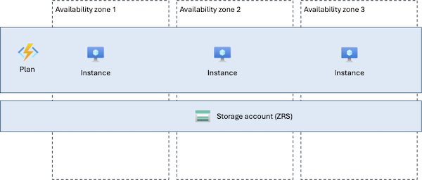
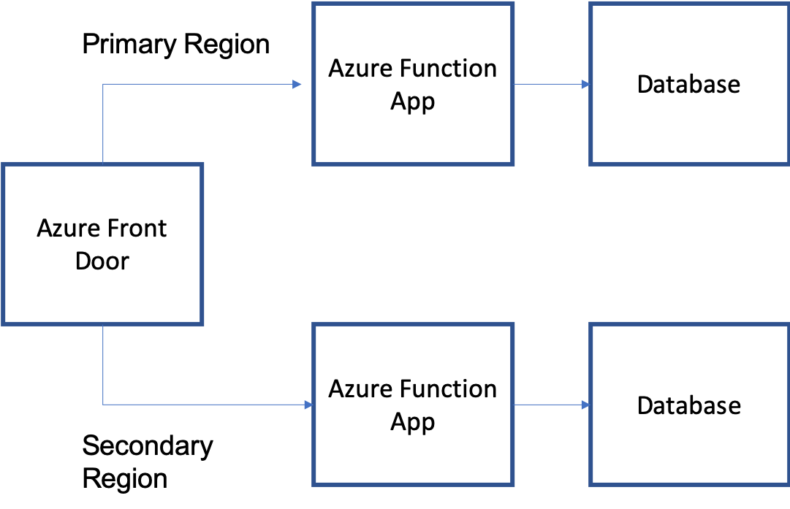
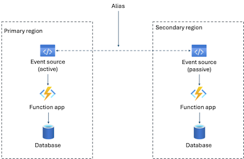

# Reliability in Azure Functions

[Azure Functions](/azure/azure-functions/functions-overview) is an event-driven compute service that lets you run small blocks of code (functions) without having to explicitly provision or manage infrastructure. Functions can respond to events such as HTTP requests, timers, queue messages, and changes in other Azure services, making it well-suited for processing data, integrating systems, and running background tasks.

[!INCLUDE [Shared responsibility](includes/reliability-shared-responsibility-include.md)]

This article describes how to make Azure Functions resilient to a variety of potential outages and problems, including transient faults, availability zone failures, and region-wide failures. It also describes cross-region disaster recovery strategies and highlights key information about the Azure Functions service level agreement (SLA).

## Production deployment recommendations

The Azure Well-Architected Framework provides recommendations across reliability, performance, security, cost, and operations. To understand how these areas influence each other and contribute to a reliable Azure Functions solution, see [Architecture best practices for Azure Functions](/azure/well-architected/service-guides/azure-functions).

## Reliability architecture overview

[!INCLUDE [Reliability architecture overview introduction](includes/reliability-architecture-overview-introduction-include.md)]

When you deploy Azure Functions, you create and configure several resources that work together:

### Plan

A **plan** defines the hosting environment for your function apps. The plan determines the compute resources available, the pricing model, and the scaling behavior. The type of plan you choose significantly affects the reliability characteristics of your function app.

Azure Functions is available on several different hosting plans, each with different capabilities and reliability characteristics:

- **[Consumption plan](/azure/azure-functions/consumption-plan):** The original serverless tier. You don't pay for dedicated infrastructure — you pay only for function executions and the resources they consume.
- **[Flex Consumption plan](/azure/azure-functions/flex-consumption-plan):** A modern serverless tier that provides additional capabilities and runs on more modern infrastructure.
- **[Premium plan](/azure/azure-functions/functions-premium-plan)** (also called Elastic Premium): Provides dedicated infrastructure that the service scales automatically. Premium plans offer features such as VNet connectivity, always-ready instances, and larger instance sizes.
- **[Dedicated (App Service) plan](/azure/azure-functions/dedicated-plan):** Runs your function app on App Service infrastructure that you manage. This plan is a good choice when you already have App Service plans that are underutilized.

::: zone pivot="consumption"

With a Consumption plan, the plan resource is required but you don't need to configure it directly. The platform manages all infrastructure provisioning and scaling behind the scenes.

::: zone-end

::: zone pivot="flex-consumption"

With a Flex Consumption plan, the plan resource is required but you don't need to configure it directly. The platform manages all infrastructure provisioning and scaling behind the scenes.

::: zone-end

::: zone pivot="premium"

With a Premium plan, you configure the plan to specify the instance size and minimum instance count. The platform provisions virtual machines behind the scenes based on your configuration and manages scaling automatically.

::: zone-end

::: zone pivot="dedicated"

With a Dedicated (App Service) plan, you configure the plan to specify the SKU (instance size) and instance count. You are effectively running your function app on App Service infrastructure. For more details about how App Service plans work, see [Reliability in Azure App Service](reliability-app-service.md).

::: zone-end

### Function app

A *function app* is an application that contains one or more *functions*. Each function contains the code that implements your business logic. A function app runs on a plan and uses the compute resources that the plan provides.

### Storage account

When you create a function app, you must specify a [storage account](/azure/azure-functions/storage-considerations). The storage account is used to manage aspects of the function app's internal operations, including function code storage, logging, and concurrency management (such as blob leases for certain trigger types).

> [!IMPORTANT]
> The storage account is a critical part of your Azure Functions reliability architecture. You should configure it for the same level of resilience as your function app. For guidance on configuring storage account reliability, see [Reliability in Azure Blob Storage](reliability-storage-blob.md).

### Triggers and bindings

Azure Functions uses **triggers**, **input bindings**, and **output bindings** to integrate with other services:

- A **trigger** defines the event that causes a function to execute. For example, an HTTP trigger responds to web requests, a timer trigger runs on a schedule, and a Blob Storage trigger fires when a blob is created or modified.
- An **input binding** provides data to the function from an external service. For example, reading a blob from a storage account.
- An **output binding** writes data from the function to an external service. For example, saving a record to a database or writing a blob to a storage container.

Triggers and bindings are important to understand from a reliability perspective because they run platform-managed code that interacts with external services on your behalf. This means your function takes a dependency on the reliability of both the binding code and the external service it connects to. See [Resilience to transient faults](#resilience-to-transient-faults) for more details.

## Resilience to transient faults

[!INCLUDE [Resilience to transient faults](includes/reliability-transient-fault-description-include.md)]

Azure Functions handles transient faults differently depending on whether the fault occurs in platform-managed code or in your own function code.

**Triggers and bindings (platform-managed):** The Azure Functions platform includes built-in transient fault handling for triggers and bindings. When a transient fault occurs while a trigger is firing or a binding is reading or writing data, the platform automatically retries the operation. This built-in retry behavior helps ensure that temporary connectivity issues or service blips don't prevent your function from executing. However, this protection only covers transient faults — permanent failures (such as a misconfigured connection string or a deleted resource) aren't retried.

**Your function code (your responsibility):** Within the body of your function, you are responsible for handling transient faults when you make calls to external services. You should implement retry logic, timeouts, and circuit breaker patterns as appropriate for any external service calls made in your function code. Design your functions to be idempotent wherever possible, so that retries don't cause duplicate side effects.

## Resilience to availability zone failures

[!INCLUDE [Resilience to availability zone failures](~/reusable-content/ce-skilling/azure/includes/reliability/reliability-availability-zone-description-include.md)]

::: zone pivot="consumption"

The Consumption plan doesn't support availability zones. If zone redundancy is a requirement for your workload, consider using the Flex Consumption plan, Premium plan, or Dedicated (App Service) plan instead.

::: zone-end

::: zone pivot="flex-consumption"

The Flex Consumption plan supports zone-redundant deployments.

::: zone-end

::: zone pivot="premium"

The Premium plan supports zone-redundant deployments.

::: zone-end

::: zone pivot="flex-consumption,premium"

When zone redundancy is enabled, the platform automatically spreads your plan instances across all availability zones in the selected region. If any availability zone in the region has a problem, your functions continue to run using instances in healthy zones.

You must also enable zone-redundant storage (ZRS) on the host storage account, which ensures that it's resilient to zone outages as well.

::: zone-end

::: zone pivot="dedicated"

The Dedicated (App Service) plan supports zone-redundant deployment. When zone redundancy is enabled, the platform automatically spreads your instances across all availability zones in the selected region. For full details on how App Service handles zone redundancy, see [Reliability in Azure App Service](reliability-app-service.md).

::: zone-end

::: zone pivot="flex-consumption,premium"

### Requirements

::: zone-end

::: zone pivot="flex-consumption"

- **Region support:** Zone-redundant Flex Consumption plans can be deployed into the following regions:

    | Americas         | Europe               | Middle East    | Africa              | Asia Pacific   |
    |------------------|----------------------|----------------|---------------------|----------------|
    | Brazil South     | Germany West Central | Israel Central | South Africa North  | Australia East |
    | Canada Central   | Italy North          | UAE North      |                     | Central India  |
    | East US          | North Europe         |                |                     | East Asia      |
    | East US 2        | Norway East          |                |                     | Japan East     |
    | West US 2        | Poland Central       |                |                     | Southeast Asia |
    | West US 3        | Sweden Central       |                |                     |                |
    |                  | UK South             |                |                     |                |
    |                  | West Europe          |                |                     |                |

::: zone-end

::: zone pivot="premium"

- **Region support:** Zone-redundant Premium plans can be deployed into the following regions:

    | Americas         | Europe               | Middle East    | Africa             | Asia Pacific   |
    |------------------|----------------------|----------------|--------------------|----------------|
    | Brazil South     | France Central       | Israel Central | South Africa North | Australia East |
    | Canada Central   | Germany West Central | Qatar Central  |                    | Central India  |
    | Central US       | Italy North          | UAE North      |                    | China North 3  |
    | East US          | North Europe         |                |                    | East Asia      |
    | East US 2        | Norway East          |                |                    | Japan East     |
    | South Central US | Sweden Central       |                |                    | Southeast Asia |
    | West US 2        | Switzerland North    |                |                    |                |
    | West US 3        | UK South             |                |                    |                |
    |                  | West Europe          |                |                    |                |

- **Minimum instance count:** A minimum of two always-ready instances is required when zone redundancy is enabled for Premium plans.

::: zone-end

::: zone pivot="flex-consumption,premium"

- **Storage account requirements:** You must use a [zone-redundant storage account (ZRS)](/azure/storage/common/storage-redundancy#zone-redundant-storage) for your function app's default host storage account.

### Considerations

::: zone-end

::: zone pivot="flex-consumption"

- You can enable availability zones during app creation or update an existing plan.
- If you use a storage account that isn't ZRS, your app might behave unexpectedly during a zone outage.
- Both Windows and Linux are supported.

::: zone-end

::: zone pivot="premium"

- You can only enable availability zones during app creation. You can't convert an existing Premium plan to use availability zones.
- For existing Premium plans without zone redundancy, migration to zone-redundant plans requires following the [migration guidance](migrate-functions.md).
- If you use a storage account that isn't ZRS, your app might behave unexpectedly during a zone outage.
- Both Windows and Linux are supported.

> [!IMPORTANT]
> Azure Functions can run on the Azure App Service platform. In the App Service platform, plans that host Premium plan function apps are referred to as Elastic Premium plans, with SKU names like `EP1`. If you choose to run your function app on a Premium plan, make sure to create a plan with an SKU name that starts with `E`, such as `EP1`. App Service plan SKU names that start with `P`, such as `P1V2` (Premium V2 Small plan), are [Dedicated hosting plans](/azure/azure-functions/dedicated-plan). Because they're Dedicated and not Elastic Premium, plans with SKU names starting with `P` don't scale dynamically and can increase your costs.

::: zone-end

::: zone pivot="flex-consumption,premium"

### Instance distribution across zones

::: zone-end

::: zone pivot="flex-consumption"

When you configure Flex Consumption plan apps as zone-redundant, the platform automatically spreads instances across the zones in the selected region, with different rules for always-ready versus on-demand instances:

- **Always-ready instances** are distributed across at least two zones in a round-robin fashion.
- **On-demand instances** (created as a result of event source volumes as the app scales beyond always-ready) are distributed across availability zones on a _best effort_ basis. Faster scale-out is given preference over even distribution across zones. The platform attempts to even out the distribution over time.
- To ensure zone resiliency, the platform automatically maintains at least two always-ready instances for each [per-function scaling function or group](/azure/azure-functions/flex-consumption-plan#per-function-scaling), regardless of the always-ready configuration for the app. Any instances created by the platform are platform-managed, billed as always-ready instances, and don't change the always-ready configuration settings.

::: zone-end

::: zone pivot="premium"

When you configure Elastic Premium function app plans as zone-redundant, the platform automatically spreads the function app instances across the zones in the selected region.

Instance spreading with a zone-redundant deployment follows these rules, even as the app scales in and out:

- The minimum function app instance count is two.
- When you specify a capacity larger than the number of zones, the instances are spread evenly only when the capacity is a multiple of the number of zones.
- For a capacity value more than Number of Zones * Number of instances, extra instances are spread across the remaining zones.

::: zone-end

::: zone pivot="flex-consumption,premium"

### Cost

::: zone-end

::: zone pivot="flex-consumption"

- There's no separate meter associated with enabling availability zones. Pricing for instances used for a zone-redundant Flex Consumption app is the same as a single-zone Flex Consumption app.
- When you enable availability zones in an app with an always-ready instance configuration of fewer than two instances for each [per-function scaling function or group](/azure/azure-functions/flex-consumption-plan#per-function-scaling), the platform automatically creates two instances of the [always-ready](/azure/azure-functions/flex-consumption-plan#always-ready-instances) type for each per-function scaling function or group. These new instances are also billed as always-ready instances.

::: zone-end

::: zone pivot="premium"

- There's no extra cost associated with enabling availability zones. Pricing for a zone-redundant Premium App Service plan is the same as a single-zone Premium plan.
- If you enable availability zones on a plan with fewer than two instances, the platform enforces a minimum instance count of two for that App Service plan, and you're charged for both instances.

::: zone-end

::: zone pivot="flex-consumption,premium"

For pricing details, see [Azure Functions pricing](https://azure.microsoft.com/pricing/details/functions/).

### Configure availability zone support

::: zone-end

::: zone pivot="flex-consumption"

- **Create a new zone-redundant Azure Functions resource.** For step-by-step configuration instructions, see [Configure availability zones for Azure Functions](/azure/azure-functions/functions-premium-plan#availability-zones).
- You can enable availability zones during app creation or update an existing plan.

::: zone-end

::: zone pivot="premium"

- **Create a new zone-redundant Azure Functions resource.** For step-by-step configuration instructions, see [Configure availability zones for Azure Functions](/azure/azure-functions/functions-premium-plan#availability-zones).
- You can only enable availability zones during app creation. You can't convert an existing Premium plan to use availability zones.
- For existing Premium plans without zone redundancy, migration to zone-redundant plans requires following the [migration guidance](migrate-functions.md).

::: zone-end

::: zone pivot="flex-consumption,premium"

### Behavior when all zones are healthy

::: zone-end

::: zone pivot="flex-consumption,premium"

- **Cross-zone operation:** When you configure zone redundancy on Azure Functions, requests are automatically spread across the instances in each availability zone. A request might go to any instance in any availability zone.
- **Cross-zone data replication:** Because Azure Functions is a stateless compute service, there's no customer data to replicate between zones. The platform handles configuration and metadata replication automatically.

::: zone-end

::: zone pivot="flex-consumption,premium"

### Behavior during a zone failure\

- **Detection and response:** The Azure Functions platform is responsible for detecting a failure in an availability zone. You don't need to do anything to initiate a zone failover.

[!INCLUDE [Availability zone down notification (Service Health and Resource Health)](includes/reliability-availability-zone-down-notification-service-resource-include.md)]

- **Active requests:** When an availability zone is unavailable, any requests in progress that are connected to an instance in the faulty availability zone are terminated and need to be retried.

- **Expected data loss:** Zone failures aren't expected to cause data loss because Azure Functions is a stateless service.

- **Expected downtime:** During zone outages, connections might experience brief interruptions that typically last a few seconds as traffic is redistributed. Ensure that your applications are prepared by following [transient fault handling guidance](#resilience-to-transient-faults).

- **Traffic rerouting:** When a zone is unavailable, Azure Functions detects the loss of the zone and creates new instances in another availability zone. Then, any new requests are automatically spread across all active instances.

### Zone recovery

When the availability zone recovers, Azure Functions automatically restores instances in the availability zone, removes any temporary instances created in the other availability zones, and reroutes traffic between your instances as normal.

### Test for zone failures

The Azure Functions platform manages traffic routing, failover, and zone recovery for zone-redundant resources. You don't need to initiate anything. Because this feature is fully managed, you don't need to validate availability zone failure processes.

::: zone-end

## Resilience to region-wide failures

Azure Functions is a single-region service. If the region becomes unavailable, your Azure Functions resource is also unavailable.

### Custom multi-region solutions for resiliency

To avoid loss of execution during outages, you can redundantly deploy the same functions to function apps in multiple regions.

You're responsible for:

- Deploying function apps to multiple regions
- Managing traffic distribution between regions
- Implementing failover mechanisms
- Ensuring data consistency across regions (if applicable)
- Monitoring and managing cross-region deployments

When you run the same function code in multiple regions, there are two patterns to consider: active-active and active-passive.

#### Active-active pattern for HTTP trigger functions

With an active-active pattern, functions in both regions are actively running and processing events, either in a duplicate manner or in rotation. You should use an active-active pattern in combination with [Azure Front Door](/azure/frontdoor/front-door-overview) for your critical HTTP-triggered functions, which can route and round-robin HTTP requests between functions running in multiple regions. Front Door can also periodically check the health of each endpoint. When a function in one region stops responding to health checks, Azure Front Door takes it out of rotation and only forwards traffic to the remaining healthy functions.

#### Active-passive pattern for non-HTTP trigger functions

For event-driven, non-HTTP-triggered functions (such as Service Bus and Event Hubs triggered functions), use an active-passive pattern. With an active-passive pattern, functions run actively in the region that's receiving events, while the same functions in a second region remain idle. The active-passive pattern provides a way for only a single function to process each message while providing a mechanism to fail over to the secondary region in a disaster. Function apps work with the failover behaviors of the partner services, such as [Azure Service Bus geo-recovery](/azure/service-bus-messaging/service-bus-geo-dr) and [Azure Event Hubs geo-recovery](/azure/event-hubs/event-hubs-geo-dr).

Consider an example topology using an Azure Event Hubs trigger. In this case, the active-passive pattern requires the following components:

- Azure Event Hubs deployed to both a primary and secondary region.
- [Geo-disaster enabled](/azure/service-bus-messaging/service-bus-geo-dr) to pair the primary and secondary event hubs. This also creates an _alias_ you can use to connect to event hubs and switch from primary to secondary without changing the connection info.
- Function apps deployed to both the primary and secondary (failover) region, with the app in the secondary region essentially being idle because messages aren't being sent there.
- Function app triggers on the _direct_ (nonalias) connection string for its respective event hub.
- Publishers to the event hub should publish to the alias connection string.

Before failover, publishers sending to the shared alias route to the primary event hub. The primary function app is listening exclusively to the primary event hub. The secondary function app is passive and idle. As soon as failover is initiated, publishers sending to the shared alias are routed to the secondary event hub. The secondary function app now becomes active and starts triggering automatically. Effective failover to a secondary region can be driven entirely from the event hub, with the functions becoming active only when the respective event hub is active.

Read more on information and considerations for failover with [Service Bus](/azure/service-bus-messaging/service-bus-geo-dr) and [Event Hubs](/azure/event-hubs/event-hubs-geo-dr).

For disaster recovery for Durable Functions, see [Disaster recovery and geo-distribution in Azure Durable Functions](/azure/azure-functions/durable/durable-functions-disaster-recovery-geo-distribution).

## Service-level agreement

[!INCLUDE [Service-level agreement](includes/reliability-service-level-agreement-include.md)]

::: zone pivot="consumption"

The Consumption plan doesn't have a guaranteed SLA.

::: zone-end

::: zone pivot="flex-consumption"

The Flex Consumption plan has a 99.95% availability SLA when zone redundancy is enabled.

::: zone-end

::: zone pivot="premium"

The Premium plan has a 99.95% availability SLA when zone redundancy is enabled.

::: zone-end

::: zone pivot="dedicated"

The Dedicated (App Service) plan inherits the SLA from the underlying App Service plan. For details, see [Reliability in Azure App Service](reliability-app-service.md).

::: zone-end

## Related content

- [Configure availability zones for Azure Functions](/azure/azure-functions/functions-premium-plan#availability-zones)
- [Disaster recovery and geo-distribution in Azure Durable Functions](/azure/azure-functions/durable/durable-functions-disaster-recovery-geo-distribution)
- [Create Azure Front Door](/azure/frontdoor/quickstart-create-front-door)
- [Event Hubs failover considerations](/azure/event-hubs/event-hubs-geo-dr#considerations)
- [Azure Architecture Center's guide on availability zones](/azure/architecture/high-availability/building-solutions-for-high-availability)
- [Reliability in Azure](./overview.md)
