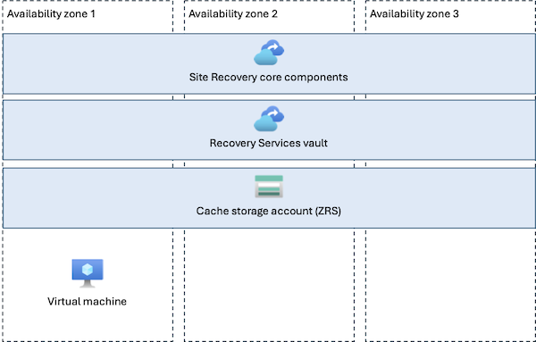
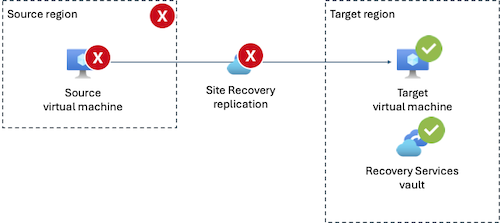
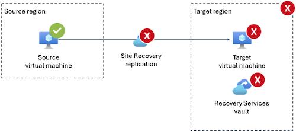
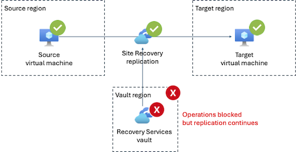

# Reliability in Azure Site Recovery

[Azure Site Recovery](/azure/site-recovery/site-recovery-overview) is a managed replication and failover service for virtual machines and other infrastructure, designed to keep workloads available during outages. It continuously replicates workloads from primary sites to secondary locations, ensuring minimal data loss and downtime. In the event of planned maintenance or unexpected disruptions, it orchestrates failover and failback processes. This service supports disaster recovery for on-premises environments and Azure VMs, helping organizations maintain business continuity.

[!INCLUDE [Shared responsibility](includes/reliability-shared-responsibility-include.md)]

This article describes how to make Azure Site Recovery resilient to a variety of potential outages and problems, including transient faults, availability zone outages, and region outages. It also highlights some key information about the Azure Site Recovery service level agreement (SLA).

> [!NOTE]
> This document describes how the Azure Site Recovery service itself is, or can be made, resilient to various issues. It doesn't explain how to use Azure Site Recovery to protect your VMs or other assets. To learn about how to use Azure Site Recovery, see [About Site Recovery](/azure/site-recovery/site-recovery-overview).

## Production deployment recommendations for reliability

For production workloads, we recommend that you:

> [!div class="checklist"]
> - For Azure to Azure disaster recovery, use [High Churn](/azure/site-recovery/concepts-azure-to-azure-high-churn-support) for VMs that have a high rate of data change, to improve your recovery point objective (RPO).
> - For Azure to Azure disaster recovery, configure the cache storage account to use zone-redundant storage (ZRS).
> - Deploy your Recovery Services vault in your target region for replication.

> [!WARNING]
> **Note to PG:** Please verify these recommendations.

## Reliability architecture overview

When you use Azure Site Recovery, you define a *source* and *target*, which represent the VMs that are replicated:

- The *source* can be an Azure VM, or a VM or server from another supported source, including on-premises physical servers, VMware VMs, and Hyper-V VMs.
- The *target* is always an Azure VM. For Azure-to-Azure VM replication, the target can be a different region or availability zone to the source VM.

You're responsible for deploying and configuring other resources:

- *Recovery Services vault*, which Site Recovery uses to store your replication configuration settings. The vault doesn't store your replicated data. The redundancy configuration of the vault isn't important for Site Recovery, but it's important if you use the same vault for Azure Backup.

    A vault can include additional configuration, such as:
    - *Replication policy*, which configures the snapshot frequency and retention length.
    - [*Recovery plan*](/azure/site-recovery/recovery-plan-overview), which coordinates the order in which machines fail over and can include scripts and manual actions.

- For Azure-to-Azure replication, a *cache storage account*, that stores a copy of the source data in its region before it's replicated to the target. The redundancy configuration of your cache storage account can affect your reliability during an availability zone outage.

> [!NOTE]
> This guide focuses on the reliability of the Azure-based components of Azure Site Recovery and the replication relationship. If you replicate data or VMs from an on-premises environment or another cloud provider, you should also consider the reliability of the components outside of Azure.

For more information about the components you deploy, see:

- [Azure to Azure disaster recovery architecture](/azure/site-recovery/azure-to-azure-architecture)
- [Hyper-V to Azure disaster recovery architecture](/azure/site-recovery/hyper-v-azure-architecture)
- [VMware to Azure disaster recovery architecture](/azure/site-recovery/vmware-azure-architecture-modernized)
- [Physical server to Azure disaster recovery architecture](/azure/site-recovery/physical-server-azure-architecture-modernized)

The core Site Recovery service runs on infrastructure that Microsoft manages. This document refers to these components collectively as the *core Site Recovery service*.

## Resilience to transient faults

Transient faults are short, intermittent failures in components. They occur frequently in a distributed environment like the cloud, and they're a normal part of operations. Transient faults correct themselves after a short period of time.

Site Recovery automatically handles transient faults that occur during replication by retrying. You don't need to configure transient fault handling for Azure Site Recovery.

## Resilience to availability zone failures

[!INCLUDE [Resilience to availability zone failures](~/reusable-content/ce-skilling/azure/includes/reliability/reliability-availability-zone-description-include.md)]

To understand how Azure Site Recovery replication behaves during availability zone failures, you need to consider the following components of the service:

- **Core Site Recovery service:** The Site Recovery service is designed to be resilient to availability zone failures in supported regions. The internal components of the service support zone redundancy automatically with no customer configuration required.

- **Recovery Services vault:** The vault stores configuration data. In regions where Site Recovery supports zone resilience, configuration data in the vault is also zone-resilient.

- **Cache storage account:** For Azure-to-Azure replication, you're responsible for ensuring that the cache storage account is zone-redundant by deploying it using the ZRS tier.

    If you use the locally redundant storage (LRS) Azure Storage replication tier for your cache storage account, then if a zone fails, Site Recovery might not be able to replicate recently changed data to your target.

The following diagram shows an example of how Site Recovery uses availability zones in an Azure-to-Azure disaster recovery configuration:

> [!NOTE]
> Azure Site Recovery can help you to fail over between VMs in different availability zones. For more information, see [Enable Azure VM disaster recovery between availability zones](/azure/site-recovery/azure-to-azure-how-to-enable-zone-to-zone-disaster-recovery).

### Requirements

**Region support:**

- **Core Site Recovery service and Recovery Services vaults:** Azure Site Recovery is deploying support for availability zones in [all availability zone-enabled regions](./regions-list.md). In regions that aren't yet zone-resilient, zone failures might affect operations.

    > [!WARNING]
    > **Note to PG:** Can we give any details on the regions that aren't yet zone-resilient, and the timeline for when they will be?

- **Cache storage account:** You can deploy a ZRS storage account in all availability zone-enabled regions.

### Cost

Site Recovery is billed based on the number of VM instances protected, regardless of their availability zone configuration. For more information, see [Azure Site Recovery pricing](https://azure.microsoft.com/pricing/details/site-recovery/).

### Configure availability zone support

- **Core Site Recovery service:** You don't configure zone resiliency on the core Site Recovery service. Microsoft enables zone resiliency in supported regions.

- **Recovery Services vault:** Although Recovery Services vaults enable you to configure a level of redundancy, this configuration setting isn't used for Site Recovery. You don't need to configure your vault for zone redundancy when you use Site Recovery.

- **Cache storage account:** When you use Azure-to-Azure replication, you're responsible for creating the cache storage account and for configuring it with the appropriate level of redundancy. To make it zone-redundant, configure it for the ZRS replication type. For more information, see [Reliability in Azure Blob Storage](./reliability-storage-blob.md).

### Behavior when all zones are healthy

This section describes what to expect when Site Recovery is used in a region with availability zone support for the core service, your cache storage account is configured to use ZRS, and all availability zones are operational.

- **Traffic routing between zones:** Site Recovery uses infrastructure in multiple availability zones to trigger and run replication jobs. The service manages this infrastructure transparently to you.

- **Data replication between zones:** Site Recovery and Azure Storage handle zone data replication as follows:

    - *Site Recovery configuration:* Site Recovery replicates your configuration data across zones even if your vault is configured to use LRS.

        > [!WARNING]
        > **Note to PG:** Please verify that this is accurate.

    - *Cache storage account:* If your cache storage account is configured to use ZRS, Azure Storage synchronously replicates the cached data between zones.

### Behavior during a zone failure

This section describes what to expect when Site Recovery is used in a region with availability zone support for the core service, your cache storage account is configured to use ZRS, and an availability zone outage occurs.

> [!NOTE]
> If the failed zone contains the source VM, you're responsible for triggering failover to the target. For more information, see:
> - [Fail over Azure VMs to a secondary region](/azure/site-recovery/azure-to-azure-tutorial-failover-failback)
> - [Fail over VMware VMs](/azure/site-recovery/vmware-azure-tutorial-failover-failback-modernized)
> - [Fail over Hyper-V VMs to Azure](/azure/site-recovery/hyper-v-azure-failover-failback-tutorial)

- **Detection and response:** The Site Recovery platform automatically detects failures in an availability zone and initiates a response. No manual intervention is required to initiate a zone failover for the Site Recovery service itself. However, if the zone outage affects your source VM, you might need to [initiate failover of your VM](/azure/site-recovery/azure-to-azure-tutorial-failover-failback).

[!INCLUDE [Availability zone down notification (Service Health only)](./includes/reliability-availability-zone-down-notification-service-include.md)]

- **Active requests:** The effect on active replication jobs depends on the type of replication:

    - *Zone-to-zone and region-to-region replication of Azure VMs:* If either the source or target instance is in the failed zone, replication pauses until both instances are available again.

        If the failed zone doesn't contain the source or target VM, replication continues to run.

        > [!WARNING]
        > **Note to PG:** Please confirm the above statement is accurate.

    - *On-premises to Azure:* If the target instance is in the failed zone, replication pauses until the instance is available again.

        If the failed zone doesn't contain the target VM, replication continues to run.

- **Expected data loss:** No data loss is expected during a zone failure.

- **Expected downtime:** If the failed zone contains either the source or target VM, replication pauses until both instances are available again.

- **Traffic rerouting:** Site Recovery and Azure Storage handle traffic rerouting as follows:

    - *Site Recovery core service:* The Site Recovery service automatically reroutes traffic to instances in healthy availability zones. You don't need to take any action.

    - *Cache storage account:* Azure Storage automatically routes any requests for the cache data to healthy zones.

### Zone recovery

When the affected availability zone recovers, Site Recovery automatically resumes any replication jobs that might have paused during the zone outage.

You're responsible for initiating failback for any servers or VMs that you failed over during the zone outage. For more information, see:

- *Zone-to-zone and region-to-region replication of Azure VMs:* [Fail back Azure VM to the primary region](/azure/site-recovery/azure-to-azure-tutorial-failback)

- *On-premises to Azure replication:*
    - *Physical to Azure replication:* [Physical server to Azure disaster recovery architecture](/azure/site-recovery/physical-server-azure-architecture-modernized)
    - *Hyper-V to Azure replication:* [Hyper-V to Azure disaster recovery architecture](/azure/site-recovery/hyper-v-azure-architecture#failover-and-failback-process)
    - *VMware to Azure replication:* [About on-premises disaster recovery failover/failback](/azure/site-recovery/failover-failback-overview-modernized)

### Test for zone failures

The Site Recovery platform manages zone resiliency for its internal components. Because this feature is fully managed, you don't need to initiate or validate availability zone failure processes.

However, you can use [disaster recovery drills](/azure/site-recovery/azure-to-azure-tutorial-dr-drill) to test your VM failover.

## Resilience to region-wide failures

For Azure-to-Azure replication, Site Recovery is designed to provide resilience to region failures by enabling failover of VMs to a healthy target region. For more information, see [Replicate Azure VMs to another Azure region](/azure/site-recovery/azure-to-azure-how-to-enable-replication).

#### Configure multi-region support

- **Recovery Services vault:** A vault must be deployed into a specific Azure region. If that region has a failure, replication continues but you can't perform Site Recovery operations. For that reason, it's a good practice to deploy your Recovery Services vault into your target region.

    Although Recovery Services vaults enable you to configure a level of redundancy, this configuration setting isn't used for Site Recovery. You don't need to configure your vault for geo-redundancy when you use Site Recovery.

- **Cache storage account:** Because the cache storage account is only used as a temporary location for data before it's replicated, you shouldn't configure it to use GRS.

### Behavior during a region failure

The specific behavior of the Site Recovery core service during a region failure depends on which region experiences the failure:

- **Failure in source region:** For Azure-to-Azure replication, you can trigger a failover when the source region is unavailable.

    Because the source region is unavailable, replication stops until the VM in the source region is healthy.

    

- **Failure in target region:** Because the target region is unavailable, replication stops, and you can't fail over to the target until the region is healthy.

    

- **Failure in the region that contains the vault:** If the vault is deployed into a third region (not the source or target region) and that region experiences a failure, Site Recovery continues to replicate your data but you can't initiate any operations.

    

## Resilience to service maintenance

Azure automatically manages updates and maintenance for the core Site Recovery service. Maintenance operations don't require downtime and don't interrupt replication of your VMs and servers.

However, you're responsible for applying updates to Site Recovery components on your VMs and servers. For more information, see [Service updates in Site Recovery](/azure/site-recovery/service-updates-how-to).

## Service-level agreement

[!INCLUDE [Service-level agreement](includes/reliability-service-level-agreement-include.md)]

For Azure Site Recovery, there are separate SLAs that cover the following:

- **Service availability**, which means the Site Recovery service is available to fail over protected instances. A protected instance is a VM or physical server that's replicated to a secondary location. To be eligible for this SLA, you must retry failed failover attempts at least every 30 minutes.
- **Recovery time objective (RTO)**, which is the length of time it takes from when you (or scripts you write) trigger a failover to when the target VM is running. This time excludes any manual actions or script execution.

The SLA only provides for service credits when there's sufficient capacity available in the secondary region.

## Related content

- [About Azure Site Recovery](/azure/site-recovery/site-recovery-overview)
- [Reliability in Azure](/azure/reliability/overview)
