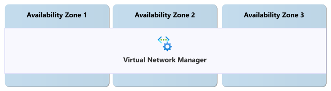
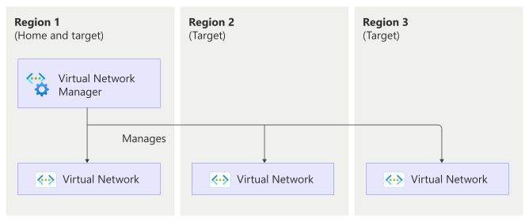

# Reliability in Azure Virtual Network Manager

[Azure Virtual Network Manager](/azure/virtual-network-manager/overview) is a centralized management service that helps you group, configure, deploy, and manage virtual networks across Azure subscriptions and Microsoft Entra tenants. You can use it to apply connectivity, security, IP address management, and routing configurations at scale.

[!INCLUDE [Shared responsibility](includes/reliability-shared-responsibility-include.md)]

This article describes how to make Azure Virtual Network Manager resilient to transient faults, availability zone failures, region-wide failures, and service maintenance. It also highlights the service-level agreement (SLA).

## Reliability architecture overview

Virtual Network Manager is a centralized network management service. You create an *instance* of Virtual Network Manager, define its scope, and place virtual networks into *network groups*, even if those virtual networks are spread across multiple Azure regions.

After you create your Virtual Network Manager instance, you deploy connectivity, security, and routing configurations to the networks within network groups. A *deployment* represents a set of changes that are applied to virtual networks. The service manages how deployments are applied across your network resources.

As a management service, Virtual Network Manager stores and manages configuration data but it doesn't process any of your workload's traffic. Your workloads continue to use the underlying virtual networks, peerings, gateways, and routing resources that you configure.

For more information about the service architecture and capabilities, see [What is Azure Virtual Network Manager?](/azure/virtual-network-manager/overview).

## Resilience to transient faults

[!INCLUDE [Resilience to transient faults](includes/reliability-transient-fault-description-include.md)]

You interact with Virtual Network Manager by using the Azure portal, Azure CLI, Azure PowerShell, or an infrastructure as code (IaC) technology like Bicep or Terraform. Most of these tools automatically retry if a transient fault occurs. If you use the Azure Resource Manager APIs, ensure your application retries automatically after a short delay.

You use Virtual Network Manager to configure and manage your networking resources. It doesn't participate in processing your workload's traffic, so transient faults in the service don't affect your workload directly.

## Resilience to availability zone failures

[!INCLUDE [Resilience to availability zone failures](~/reusable-content/ce-skilling/azure/includes/reliability/reliability-availability-zone-description-include.md)]

Virtual Network Manager is automatically zone-redundant when you deploy it into an Azure region that supports availability zones.

### Requirements

**Region support:** Virtual Network Manager zone redundancy is available in all Azure regions that support Virtual Network Manager and provide availability zones. For a list of regions that support Virtual Network Manager, see [Products available by region](https://azure.microsoft.com/explore/global-infrastructure/products-by-region). For a complete list of regions that support availability zones, see [Azure regions that support availability zones](./availability-zones-service-support.md).

### Behavior when all zones are healthy

This section describes what to expect when you deploy a Virtual Network Manager instance in a region with availability zones and all availability zones are operational.

- **Cross-zone operation:** Azure networking operations route traffic between zones transparently.

- **Cross-zone data replication:** Azure Virtual Network Manager synchronously replicates its configuration state between zones.

### Behavior during a zone failure

This section describes what to expect when you deploy a Virtual Network Manager instance in a region with availability zones and there's an outage in one of the availability zones.

- **Detection and response:** Microsoft detects availability zone failures and manages all response actions. You don't need to take any action to initiate a zone failover.

[!INCLUDE [Availability zone down notification (Service Health only)](./includes/reliability-availability-zone-down-notification-service-include.md)]

- **Active deployments:** Active deployments might pause if they use affected infrastructure. After the zone recovers, they resume automatically.

- **Expected data loss:** No data or configuration loss is expected during a zone outage.

- **Expected downtime:** A small amount of downtime, usually a few seconds, might occur while the service redirects to healthy infrastructure.

- **Redistribution:** Microsoft automatically reroutes requests and management operations through the healthy zones.

### Zone recovery

When a failed availability zone recovers, Virtual Network Manager automatically restores normal operations without your intervention.

### Test for zone failures

Virtual Network Manager is a fully Microsoft-managed, zone-redundant service. Because Microsoft manages zone redundancy, you don't need to test availability zone failover scenarios.

## Resilience to region-wide failures

Virtual Network Manager is a single-region resource. If the region that hosts your Virtual Network Manager instance becomes unavailable, the instance is also unavailable. However, a Virtual Network Manager instance can manage virtual networks in other Azure regions.

### Virtual network management across regions

Virtual Network Manager can manage virtual networks that are spread across multiple Azure regions. Use this approach to manage and roll out deployments to globally distributed virtual networks. The region you deploy the Virtual Network Manager instance to is its *home region*, and each of the regions that contains virtual networks is a *target region*.

### Requirements

**Region support:** Region support depends on the type of region:

- *Home region:* For a list of regions that support deploying Virtual Network Manager instances, see [Products available by region](https://azure.microsoft.com/explore/global-infrastructure/products-by-region).

- *Target region:* You can connect your virtual network resources in any Azure region.

#### Configure multi-region support

When you create a Virtual Network Manager instance, you select the region where the instance is hosted. You then add virtual networks to the network groups that the instance manages, and those virtual networks can be in any Azure region.

#### Behavior when all regions are healthy

This section describes what to expect when all regions are operational.

- **Cross-region operation:** The Virtual Network Manager instance deploys connectivity, security, and routing configurations to virtual networks in the target regions you specify.

- **Cross-region data replication:** Virtual Network Manager stores its configuration in the home region and replicates the deployed configuration to each target region. Each target region uses its local copy of the configuration to apply settings to managed virtual networks in that region.

#### Behavior during an outage of the home region

This section describes what to expect when there's an outage in the home region, which hosts the Virtual Network Manager instance.

- **Detection and response:** Microsoft detects the region failure and manages all response actions for the Virtual Network Manager service.

[!INCLUDE [Region down notification (Service Health only)](./includes/reliability-region-down-notification-service-include.md)]

- **Active deployments:** In-progress deployments might fail because the instance can't distribute the configuration to target regions. You need to restart these deployments after the home region recovers.

- **Expected data loss:** No configuration data loss is expected, but the instance isn't available until the home region recovers. Target regions continue to operate on the last known good configuration that was replicated to them, so configurations already deployed to managed virtual networks in those regions remain intact and continue to apply during the outage.

- **Expected downtime:** The Virtual Network Manager instance is unavailable for the duration of the region outage. Management requests to the Virtual Network Manager instance fail until the region recovers.

- **Redistribution:** Virtual Network Manager doesn't replicate the instance to other regions, so management requests aren't automatically redirected to healthy regions.

#### Behavior during an outage of a target region

This section describes what to expect when there's an outage in a target region, which contains virtual networks managed by the Virtual Network Manager instance, but when the home region is still operational.

- **Detection and response:** Microsoft detects the region failure and manages all response actions for the affected Azure platform services. The Virtual Network Manager instance remains available in its home region.

[!INCLUDE [Region down notification (Service Health only)](./includes/reliability-region-down-notification-service-include.md)]

- **Active deployments:** If a deployment is in progress when the target region fails and the configuration hasn't yet been applied to resources in that target region, the deployment fails for that target region. You need to restart the deployment after the target region recovers.

    The affected target region can't receive new deployments or configuration updates during the outage. Deployments to other target regions aren't affected. After the target region recovers, Virtual Network Manager syncs the latest configuration to it.

    If the deployment had already been applied to resources in the affected region before the outage, those configurations come back online with the resources after the region is restored.

- **Expected data loss:** No configuration data loss is expected within Virtual Network Manager.

- **Expected downtime:** The Virtual Network Manager instance remains available. Virtual networks and the workloads that use them in the affected region are unavailable for the duration of the region outage.

- **Redistribution:** Virtual Network Manager continues to manage virtual networks in unaffected regions.

#### Region recovery

When a failed region recovers, Virtual Network Manager automatically restores normal operations. You might need to restart any deployments that failed during the outage.

#### Test for region failures

Virtual Network Manager is a fully Microsoft-managed service. Because Microsoft manages multiregion support, you don't need to test region failover scenarios.

## Backup and restore

Virtual Network Manager stores your network configuration. It doesn't store other types of data.

To protect your configuration, define your Virtual Network Manager resources using infrastructure as code (such as Bicep or Terraform) and store those definitions in source control. If you need to recreate an instance, redeploy it from the stored configuration.

## Resilience to service maintenance

[!INCLUDE [Service maintenance (no special callouts)](includes/reliability-maintenance-include.md)]

## Service-level agreement

[!INCLUDE [Service-level agreement](includes/reliability-service-level-agreement-include.md)]

## Related content

- [Azure Virtual Network Manager overview](/azure/virtual-network-manager/overview)
- [Azure Virtual Network Manager FAQ](/azure/virtual-network-manager/faq)
- [Configuration deployments in Azure Virtual Network Manager](/azure/virtual-network-manager/concept-deployments)
- [Common issues with Azure Virtual Network Manager](/azure/virtual-network-manager/common-issues)
- [Reliability in Azure Virtual Network](/azure/reliability/reliability-virtual-network)
